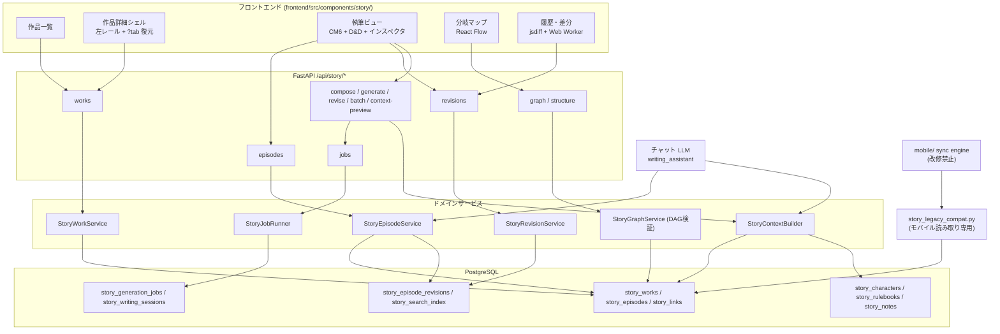
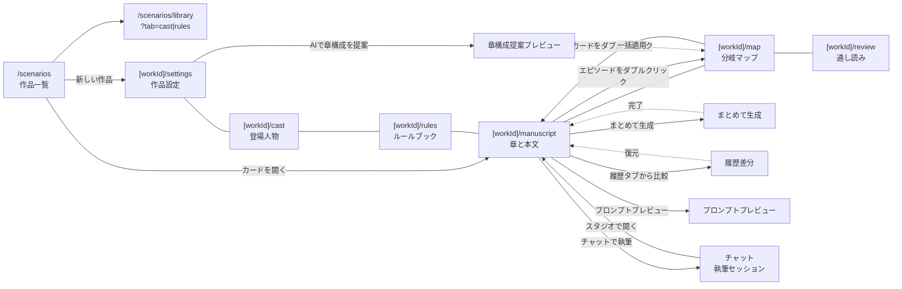
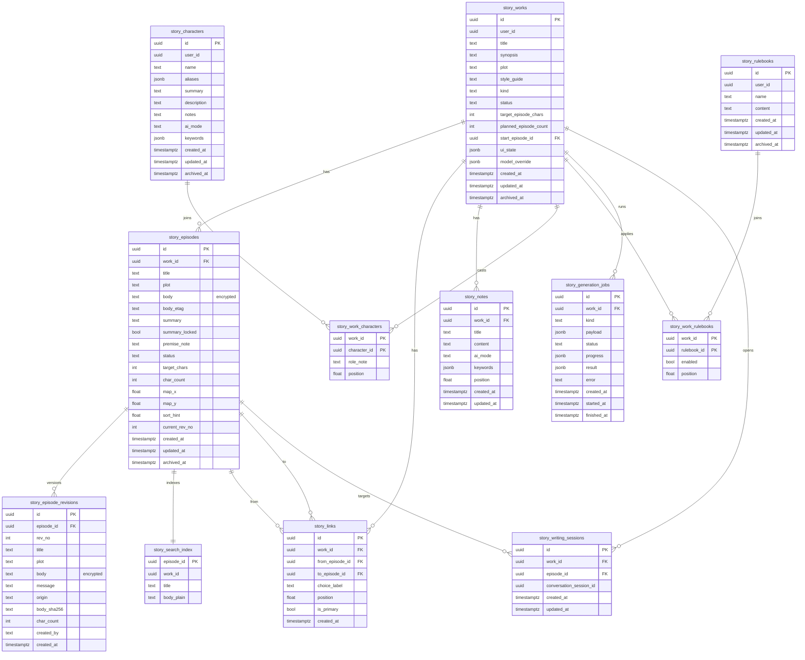
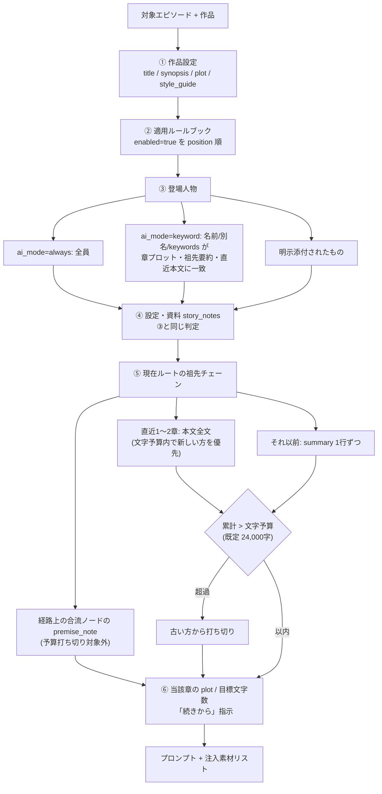

# シナリオスタジオ 再構築設計書

> **文書状態: 履歴（旧計画）**
>
> 本書は Scenario Studio を再構築する時点の設計・調査・実装分担を記録した過去の文書であり、現行製品仕様や Mobile Conformance Rebuild の正本ではない。本文中の「`mobile/` は改修禁止」「モバイル読み取り専用」「mobile sync engine（改修禁止）」は、旧計画の互換移行前提を保存した履歴である。現在の `mobile/` は Web と並ぶ first-class Native client であり、改修・分割・機能追加を禁止しない。現行 Mobile の完成条件、capability / route / scope / transport は [`docs/mobile_product_contract.md`](mobile_product_contract.md) と `contracts/product-contract.json`、共有 OpenAPI は `contracts/openapi/fastapi.json` を優先する。過去設計の履歴は削除せず、現行実装の normative source として誤読しないこと。

AoiTalk のシナリオ機能（小説執筆）を「シナリオスタジオ」として根本から作り直すための設計書である。

## この設計書の読み方

- §1〜§3 は「なぜ作り直すか」「何を満たせば完成か」を定義する。実装判断で迷ったら §2 の 5 原則と §3 の 12 ユースケースに立ち返る。
- §4〜§10 が実装仕様の本体である。画面 → データ → 履歴 → 分岐 → AI → API → フロントの順で、上位が下位を規定する。
- §11〜§15 は移行・削除・検証・分担の実務手順である。本設計はフェーズ分割せず、全機能を一括で実装する前提で書かれている。

## 用語表

| 用語 | 英語/識別子 | 定義 |
|------|-------------|------|
| 作品 | work / `story_works` | 一つの小説・TRPG シナリオ。従来の「シナリオ」に相当する最上位単位。 |
| エピソード | episode / `story_episodes` | 作品を構成する 1 章。本文・章プロット・要約・状態を持つ。分岐マップ上のノードでもある。 |
| リンク | link / `story_links` | エピソード間の遷移。選択肢ラベルを持てる有向辺。分岐マップ上のエッジ。 |
| ルート | route | 開始エピソードから辿った 1 本の経路。執筆リスト・通し読み・書き出し・AI 文脈はすべて「現在ルート」の射影である。 |
| リビジョン | revision / `story_episode_revisions` | エピソード単位の版履歴。時間軸方向の記録であり、分岐（空間軸）とは直交する。 |
| チェックポイント | checkpoint | ユーザーが名前とメッセージを付けて明示的に打つリビジョン。`origin='checkpoint'`。 |
| 前提メモ | premise note / `premise_note` | 合流エピソードに書く「この時点で確定している事実／してはいけない前提」。AI 文脈に必ず注入される。 |
| 共有プール | shared pool | 作品をまたいで再利用する登場人物・ルールブックの保管庫。ユーザー単位で 1 つ。 |

---

## 1. 背景と現状の問題

### 1.1 現状の全体像

現行のシナリオ機能は「旧 SQL テーブル層」と「Docs (knowledge_nodes) 投影層」の二重構造で動いている。正本は後者であり、作品は Docs のノードツリーとして表現される。

```
作品ルート（Supertag: シナリオ）
├── エピソード（カテゴリノード）
│   └── 第N話（本文ノード）
│       ├── 本文1行目（docs_paragraph ノード）
│       ├── 本文2行目（docs_paragraph ノード）
│       └── …（1 行 = 1 ノード）
├── 設定（カテゴリノード）
├── キャラクター（カテゴリノード）
└── 資料（カテゴリノード）
```

この投影ロジックは `src/services/docs_scenario_service.py:453-1057` に集約されている。

### 1.2 データモデルの問題

| # | 問題 | 典拠 | 影響 |
|---|------|------|------|
| D1 | 本文 1 行 = 1 ノードのため、行数と同じだけノードが増える | `docs_scenario_service.py:453-1057` | 189,820 ノードのうち大半が段落ノード。検索インデックスの 53% を占有 |
| D2 | 保存が「全行 archive → 全行再作成」 | `docs_scenario_service.py:990-1040` | 500 行の保存 1 回で 新規ノード 500 + revision 501 + search_index 500 が増える |
| D3 | 親ノードの revision に本文が入らない | 同上 | リビジョンが積まれているのに全文復元ができない。履歴として機能していない |
| D4 | 分類の正本が正規表現ヒューリスティック。実在の作品名がサービスコードに直書き | `docs_scenario_service.py:92-101`（`_NARRATIVE_EPISODE_TITLE_RE`） | 新規作品のタイトル命名に依存して分類が壊れる |
| D5 | 分類情報が `body_json.category_key` / Supertag / `parent_id` / `scenario_member` エッジの 4 箇所に多重書き込みされる | 同上 | 1 箇所でもズレると UI から作品が消える。修復スクリプト 2 本（`scripts/repair_scenario_docs_v1.py` 2,063 行、`scripts/repair_scenario_character_category_v1.py`）が必要になった |
| D6 | 章プロット・並び順・分岐が正本側に存在しない | — | 順序は Float `sort_order` のみで並べ替え API なし。`docs-view` はエッジ `created_at` 順で返す（`docs_scenario_service.py:1091`）ため、表示順が保存順に引きずられる |
| D7 | 分岐は旧 `ScenarioScene.transitions`（JSON）にしかなく、実データ 0 件 | `src/models/ecc_models.py` | ゲームブック的分岐は事実上未実装 |
| D8 | `episodes.synopsis_full` と `scenes.content` が 83 組で完全一致 | 実データ計測 | 同じ本文が旧 SQL 内部で二重保存されている |

### 1.3 実装レイヤの問題

| # | 問題 | 典拠 | 規模 |
|---|------|------|------|
| I1 | 旧テーブル層が削除されず残存 | `src/models/ecc_models.py` | `scenarios` / `scenario_episodes` / `scenario_scenes` / `scenario_characters` / `scenario_canon_entries` / `scenario_writing_sessions` / `scenario_authoring_branches` の 7 モデル |
| I2 | API が 1 ファイルに 46 本 | `src/api/scenario_routes.py` | 1,009 行 |
| I3 | サービスが 3 枚に分散し責務が重複 | `scenario_service.py` 2,080 行 / `scenario_authoring_service.py` 1,664 行 / `docs_scenario_service.py` 1,668 行 | 計 5,412 行。`scenario_authoring_service.py` は大量の到達不能コードを含む |
| I4 | ツール層にも到達不能コード | `src/tools/writing_tools.py:172-466` | 約 295 行が到達不能 |
| I5 | GET に副作用がある | `docs_scenario_service.py:509-513, 1164` / `scenario_routes.py:370` | `GET /docs-view` が `FOR UPDATE` でノード生成・タグ張替え・commit まで行う。`GET /scenarios` が毎回逆投影 sync を実行する |
| I6 | Film 機能と Docs ワークスペースを共有するためのガードが散在 | `is_film_docs_node` | 38 箇所 |

### 1.4 AI 執筆経路の現状

チャットの LLM が委譲サブエージェント `writing_assistant`（`src/agents/writing_agent.py`）を呼び、`get_writing_context` / `save_scene_draft` / `propose_scene_rewrite` 等（`src/tools/writing_tools.py`）を通じて Docs に書き込む。専用の生成 API も「まとめて生成」も存在しない。AI の提案は `knowledge_ai_suggestions` に積まれ、resolve で適用される。

### 1.5 フロントエンドの現状

| # | 問題 | 典拠 |
|---|------|------|
| F1 | 作品詳細が URL を持たない全画面モーダル | `frontend/src/app/(app)/scenarios/page.tsx`（929 行）。`/scenarios/[id]` ルートが存在しない |
| F2 | モーダル内に `ScenarioAuthoringWorkspace`（637 行）が入れ子になっている | 同上 |
| F3 | `docs-view` 系 7 エンドポイントが `openapi.json` / `api-types.gen.ts` に未反映（手書き型運用） | 型欠落が常態化 |
| F4 | 孤立した dead コンポーネントが 6 枚・約 2,000 行 | `character-editor` / `episode-editor` / `scene-editor` / `canon-editor` / `lorebook-editor` / `scenario-log-panel` |

利用可能なライブラリは CodeMirror 6 一式・`@tanstack/react-virtual`・base-ui・SWR。D&D / フローチャート / diff のライブラリは無い。自前 D&D の手本は `frontend/src/components/tasks/hooks/use-task-dnd.ts`（ClickUp 準拠の境界判定）、詳細ページの手本は `apps-workspace-shell.tsx` + `app-detail-page.tsx`（`?tab=` 復元）である。縦タブは `ui/tabs.tsx` が対応済み。

### 1.6 リビジョン基盤と git 基盤の現状

- Docs のリビジョンは全書き込み経路で自動 append される（`src/services/docs_graph_service.py` `record_node_change`:420-440）。しかし一覧・差分・復元の API も UI も皆無であり、`knowledge_revisions` のインデックスは `node_id` 単独のみ。
- `AppGitService`（`src/services/app_git_service.py`）は App 単位の隔離 repo で log / diff / restore / tag を完備しテスト済み。一方、汎用 git（`git_service.py` / `workspace_git_service.py` / `git_routes.py`）は working tree で削除済みであり、汎用パスの git は捨てる方向にある。
- 本文は DB 正本かつ AES-GCM の at-rest 暗号化（`knowledge_nodes.body_text` / `body_json`、`src/security/field_crypto.py`）である。git の平文ワークツリーは暗号化ポリシーと衝突する。

### 1.7 実データ計測（2026-08-02 時点、PostgreSQL `aoitalk_memory`）

実質シングルユーザー運用であり、作成者は `admin` のみ。

| 領域 | 計測値 | 判断材料 |
|------|--------|----------|
| 作品 | `scenarios` 8 件 = writing 4（実作品 3）+ trpg 4 | 実作品は F02_Unfeart-R 79 話 125 万字 / F01 Hibernation 51 シーン 48 万字 / F01 本編 83 シーン 38 万字 |
| 旧 SQL | episodes 84 / scenes 219（孤児 129）/ characters 77（キャラマスタ連携 0）/ canon 22 / writing_sessions 15 / authoring_branches 0 | writing_sessions は 8/2 当日も利用 = 執筆は現役 |
| 旧分岐・版管理 | `content_versions` 0 / `transitions` 0 / `beat_sheet` 0 / `fork_of` エッジ 0 / `continues_from` 0 / `branches` 0 | すべて実データ 0 件 |
| Docs | シナリオ配下 189,820 ノード（active 79,401、58% は直近修復で archived）、revisions 190,670 件 | `knowledge_nodes` 419MB / `revisions` 368MB の約半分がシナリオ由来 |
| TRPG プレイ実行系 | `play_sessions` 19 / `play_logs` 539 | 4/28〜5/11 の 2 週間に集中し以降 3 ヶ月ゼロ。参加者は全て `codex_*` テストアカウントと AI キャラ = 死んでいる |
| TRPG 資産 | `trpg_rule_items` 421 / `creature_entries` 344 / `ruleset_profiles` 5 / `trpg_scenario_documents` 4 件 8.5 万字 | 保有資産として健在 |

### 1.8 モバイルの現状（旧計画時点の記録: `mobile/` は改修禁止）

sync engine が `scenarios` / `scenario_characters` / `scenario_scenes` / `scenario_episodes` を pull して SQLite に保存し、一覧・詳細・執筆セッションの 3 画面で表示する（`mobile/src/sync/engine.ts` L115-118, L366-397）。push は REST 直叩き。canon は REST のみで取得しており、詳細画面は canon が 404 になると画面全体が壊れる構造である。

### 1.9 問題の要約

現行構造の根本問題は 3 点に集約される。

1. **モデルの不一致**: 「章立ての長文コンテンツ」を「知識グラフのノードツリー」に無理やり投影しているため、行 = ノードの爆発・4 重分類・正規表現による分類・GET の副作用がすべてここから派生している。
2. **概念の欠落**: 章プロット・並び順・分岐・版履歴という、小説執筆に必須の概念が正本側に存在しない。旧テーブルに器はあるが実データ 0 件で、UI も無い。
3. **レイヤの重複**: 旧 SQL / Docs 投影 / authoring の 3 系統が同居し、5,400 行のサービスと 46 本の API に到達不能コードが混在している。どれが正本かがコードから読み取れない。

---

## 2. 再設計の方針

### 2.1 方針 5 原則

| # | 原則 | 具体化 |
|---|------|--------|
| 1 | **専用ドメイン化** | シナリオを Docs 投影から切り離し、専用テーブル群 `story_*` を持つ一級ドメインにする。Docs・Film との名前空間衝突、4 重分類、行 = ノードモデルを根絶する。**Docs との同期は双方向とも完全廃止する。`story_*` が唯一の正本であり、Docs へは一切投影しない** |
| 2 | **モーダル廃止・URL 化** | URL を持つ作品詳細ページ `/scenarios/[workId]/…` に再編し、機能を 1 箇所へ集約する |
| 3 | **本文が正本、マップは投影** | 線形エディタの本文が正本。フローチャートは投影かつ操作面（Twine / Yarn の教訓）。カード ⇄ 本文の双方向ジャンプを必須とする |
| 4 | **分岐と履歴の直交** | 「物語の分岐（グラフ、空間軸）」と「エピソードの版履歴（リビジョン、時間軸）」を別概念として設計し、UI 用語も「分岐」「履歴」で分離する |
| 5 | **AI 文脈の見える化** | 何が注入されたかの chiclet 表示とプロンプトプレビューを提供する（Novelcrafter 準拠） |

### 2.2 実 git を採用しない理由

原則 4 を実現するにあたり、実 git は不採用とする。理由は以下の 4 点である。

| 理由 | 内容 |
|------|------|
| DB 正本との二重化 | 本文の正本は DB にある。git ワークツリーを持つと同期点が増え、どちらが正かの判断が実行時に必要になる |
| 暗号化ポリシーとの衝突 | 本文は AES-GCM で at-rest 暗号化されている（`src/security/field_crypto.py`）。git は平文ワークツリーを前提とするため、暗号化方針と正面から衝突する |
| 並行制御の欠如 | チャット経由の AI 書き込みとエディタ編集が同時に走る。git は行単位マージを提供するが、本設計が必要とするのは etag による楽観ロックであり、粒度が合わない |
| 方向性の一致 | 汎用 git サービス（`git_service.py` / `workspace_git_service.py` / `git_routes.py`）は既に削除された。App 単位の `AppGitService` だけを残す方向性と整合させる |

代わりに、**git 風の UX（履歴一覧・差分・復元・名前付きチェックポイント）を DB リビジョンで提供する**。ユーザーから見た体験は git と同等であり、実装は `story_episode_revisions` テーブル 1 枚で完結する。

### 2.3 全体アーキテクチャ



---

## 3. 正ユースケース

以下の 13 本が本機能の完成条件である。設計判断はすべてこの 13 本を満たすかどうかで決める。とりわけ **U13（既存章を前提に続きの別パターンを書く）は本機能の中心ユースケース**であり、一級の操作として各画面に導線を用意する。

| ID | ユースケース | 主担当画面 | 主担当 API |
|----|--------------|------------|------------|
| U1 | 新規作品を作り、企画から AI が章構成（エピソード案 + 接続）を提案 → 編集して確定 | 作品設定 + 章構成提案プレビュー | `POST /works`, `POST /works/{id}/compose`, `POST /works/{id}/compose/apply` |
| U2 | 章プロットを書き、AI で本文生成（目標文字数指定）→ 手直し → 保存 | 執筆ビュー | `POST /episodes/{id}/generate`, `PUT /episodes/{id}/body` |
| U3 | 第 N 章の結末を 2 ルートに分岐させ、選択肢ラベルを付けて別々に執筆 | 分岐マップ + 執筆ビュー | `POST /works/{id}/structure` |
| U4 | ルートを選んで通し読み・TXT 書き出し（ルート単位の文字数把握） | 通し読み | `GET /works/{id}/export` |
| U5 | 「やっぱりここ直したい」→ 履歴から差分確認 → 復元（履歴は消えない） | 執筆ビュー履歴タブ + 履歴差分モーダル | `GET /episodes/{id}/revisions`, `POST /episodes/{id}/restore` |
| U6 | 登場人物を共有プールから作品に参加させ、口調・設定を AI 文脈に注入 | 登場人物 | `PUT /works/{id}/characters` |
| U7 | 文体ルールを共有ルールブックとして管理し、作品ごとに適用 ON/OFF | ルールブック | `PUT /works/{id}/rulebooks` |
| U8 | プロットのある章を選択してまとめて順次生成（進捗表示・失敗時再開） | まとめて生成モーダル | `POST /works/{id}/batch-generate`, `GET /jobs/{id}` |
| U9 | リスト D&D で章順を入れ替え、マップ D&D で分岐を繋ぎ替え | 執筆ビュー + 分岐マップ | `POST /works/{id}/structure` |
| U10 | 合流章に「この時点で確定している事実」を書き、どのルートから来ても矛盾しない本文を AI に書かせる | 執筆ビュー情報タブ | `premise_note` + 文脈組み立て |
| U11 | チャットで執筆セッションを開き、会話しながら AI に本文を書かせる（従来動線の継続） | チャット + 執筆ビュー | `POST /works/{id}/write` |
| U12 | プロンプトプレビューで AI に何が渡るかを確認してから生成する | プロンプトプレビューモーダル | `GET /episodes/{id}/context-preview` |
| **U13** | **ある章を前提に、その続きの別パターンを書く**。第 1 章 → 第 2 章 A がある状態で「第 2 章 B」を作る。入口は 2 つで、(a) 第 1 章の「続きの分岐を追加」で白紙から書く、(b) 第 2 章 A の「複製して分岐にする」でコピーをベースに書き換える。どちらも結果は 第 1 章 →{第 2 章 A, 第 2 章 B} になり、ルートバーの分岐スイッチで両パターンを行き来して比較できる | 執筆ビュー（章リスト行メニュー・ルートバー）+ 分岐マップ（ノードメニュー） | `POST /works/{id}/structure`（(a) `add_link` / (b) `duplicate_as_branch`）, `POST /episodes/{id}/split` |

---

## 4. 画面設計

### 4.1 ルーティング

| パス | 画面 | 備考 |
|------|------|------|
| `/scenarios` | 作品一覧 | NovelWriter 風カード格子 |
| `/scenarios/library?tab=cast` | 共有登場人物ライブラリ | 全作品共通プール |
| `/scenarios/library?tab=rules` | 共有ルールブックライブラリ | 同上 |
| `/scenarios/[workId]` | リダイレクト | エピソードがあれば `manuscript`、無ければ `settings` へ |
| `/scenarios/[workId]/settings` | 作品設定 | 企画・全体プロット・文体・設定資料 |
| `/scenarios/[workId]/cast` | 登場人物 | 共有プールからの参加選択 |
| `/scenarios/[workId]/rules` | ルールブック | 適用 ON/OFF |
| `/scenarios/[workId]/manuscript` | 章と本文（執筆ビュー） | `?episode=<id>` でディープリンク |
| `/scenarios/[workId]/map` | 分岐マップ | `?focus=<id>` でディープリンク |
| `/scenarios/[workId]/review` | 通し読み | ルート単位の全文表示 |

実装は apps の「一覧レール + 詳細」パターン（`apps-workspace-shell.tsx` / `app-detail-page.tsx` の `?tab` 復元）と `ui/tabs.tsx` の縦タブを流用する。

### 4.2 画面遷移



### 4.3 作品一覧 `/scenarios`

| 要素 | 仕様 |
|------|------|
| レイアウト | NovelWriter 風カード格子（レスポンシブ、最小 240px 幅） |
| カード | タイトル頭文字を大きく描いたカバー、あらすじ 2 行省略、章数・総文字数 |
| カード操作 | クリックで作品を開く、ケバブから「名前を変更」「削除」 |
| ヘッダー | 「新しい作品」ボタン（プライマリ）、共有ライブラリへの導線リンク |
| 削除 | 確認ダイアログ 1 回、`archived_at` セットの論理削除 |
| ソート | 更新日時降順（固定） |

### 4.4 作品詳細シェル

**左レール**（`ui/tabs.tsx` の縦タブ）

| 項目 | アイコン | バッジ |
|------|----------|--------|
| 作品設定 | 設定 | 設定・資料件数 |
| 登場人物 | 人物 | 参加人数 |
| ルールブック | 本 | 適用中件数 |
| 章と本文 | 原稿 | 章数 |
| 分岐マップ | グラフ | 分岐点数 |
| 通し読み | 目 | — |

**上部バー**: 「作品一覧へ戻る」、作品名（インライン編集）、保存状態インジケータ（保存済み / 保存中 / 未保存の変更）、「TXT 書き出し」。

### 4.5 作品設定 `/scenarios/[workId]/settings`

| フィールド | 型 | 用途 |
|------------|-----|------|
| 作品名 | 1 行 | `title` |
| 企画・あらすじ | 複数行 | `synopsis`。AI 文脈の先頭に注入 |
| 全体プロット | 複数行（CM6） | `plot`。物語全体の流れ |
| 文体・執筆指示 | 複数行 | `style_guide`。AI 文脈の 2 番目に注入 |
| 予定章数 | 数値（任意） | `planned_episode_count`。章構成提案のヒント |
| 1 章の目標文字数 | 数値（既定 6000） | `target_episode_chars` |
| 執筆モデル | セレクト（既定「設定に従う」） | `model_override`。「設定に従う」を選ぶと `{}` を保存し、`model_routing.classes.writing` に委ねる（§8.8 の層②）。選択肢の下に、現在解決されるモデル名を補助テキストで表示する |

「AI で章構成を提案」ボタン（AI アクション色 = `--primary`、§10.7）を配置する。押下で §4.11 の章構成提案プレビューを開く。

**下部「設定・資料」リスト**（`story_notes`）

| 列 | 内容 |
|----|------|
| タイトル | 資料名 |
| 本文 | 複数行 |
| AI 参照モード | 常時 / キーワード一致 / 明示時のみ / 参照しない |
| 参照キーワード | タグ入力（`ai_mode='keyword'` のとき有効） |
| 操作 | 追加 / 編集 / 削除、D&D で並べ替え |

各行に AI 参照バッジ（常時 = 実線、キーワード = 破線、明示 = 点線、参照しない = グレー）を表示する。

### 4.6 登場人物 `/scenarios/[workId]/cast`

共有プール（全作品共通）から本作品への参加を選択する画面である。

**人物カードのフィールド**

| フィールド | AI に渡すか | 説明 |
|------------|-------------|------|
| 名前 | ○ | `name` |
| 別名 | ○（照合用） | `aliases`。キーワード一致の対象 |
| 一言サマリ | ○ | `summary`。一覧表示にも使う |
| 説明 | ○ | `description`。AI 文脈に注入される本体 |
| 非公開メモ | × | `notes`。作者用メモ。AI には一切渡さない |
| AI 参照モード | — | `ai_mode`: 常時 / キーワード一致 / 明示時のみ / 参照しない |
| 参照キーワード | — | `keywords` |
| この作品での役割メモ | ○ | `story_work_characters.role_note` |

旧 `character-editor` が持っていた項目語彙（口調・心理・背景・関係性・アーク・台詞例）は、**説明フィールドのテンプレ見出し**として提供する。「テンプレを挿入」ボタンで以下を本文に流し込む。

```
## 口調
## 心理
## 背景
## 関係性
## アーク
## 台詞例
```

これにより構造化の自由度を保ちつつ、カラム数の爆発を避ける。

### 4.7 ルールブック `/scenarios/[workId]/rules`

共有プールのルールブック一覧に対し、本作品での適用 ON/OFF チェックを付ける（NovelWriter の「適用中」に相当）。フィールドは名前 + ルール本文の 2 つのみ。適用順は D&D で変更でき、AI 文脈には `position` 順に注入される。

### 4.8 章と本文（執筆ビュー）`/scenarios/[workId]/manuscript`

3 ペイン構成である。

#### 左ペイン: エピソードリスト

| 要素 | 仕様 |
|------|------|
| 行の表示 | 番号・タイトル・文字数/目標・状態バッジ・分岐点マーク ⑂ |
| 対象 | **現在ルート**のエピソードのみ |
| D&D | 線形区間内（分岐のない連続）は D&D 並べ替え可。分岐をまたぐ移動はトーストで「分岐マップで操作してください」と誘導 |
| 未配置トレイ | リスト下部。どのリンクにも接続されていないエピソードの置き場 |
| ボタン | 「章を追加」「まとめて生成」 |
| 状態バッジ | 未着手 / 下書き / 推敲中 / 完成 / 保留 |

#### 章リスト行の操作

行ホバーで、行の右端に ⑂（続きの分岐を追加）と ⋯（メニュー）の 2 ボタンを表示する。⋯ ボタンと行の右クリックは同一のコンテキストメニューを開く。

| メニュー項目 | 挙動 |
|--------------|------|
| 開く | その章を中央ペインに読み込む（`manuscript?episode=<id>`） |
| 上に章を挿入 | 直前のリンクを張り替えて新規章を挿入（`insert_between`）。先頭なら新規章を開始点の手前に繋ぐ |
| 下に章を挿入 | 直後のリンクを張り替えて新規章を挿入（`insert_between`）。末尾なら追加のみ |
| **続きの分岐を追加** | この章の続きとして、別パターンの章を**白紙で**作る。選択肢ラベルを入力 → 新規章を作成し、この章から `story_links` を張る（⑂ ボタンと同じ） |
| **複製して分岐にする** | この章のコピーを、**同じ親（前提章）からの別パターン**として隣に並べる。元の章は変更しない。**U13 の中心操作**（詳細は下記） |
| カーソル位置で章を分割 | 中央ペインのエディタに対する操作。行メニューからは対象章を開いたうえでエディタにフォーカスを移す（実体は §4.8「エディタの右クリック操作」） |
| チェックポイントを作成 | 名前・メモを入力し、`origin='checkpoint'` のリビジョンを積む |
| 履歴を見る | インスペクタを履歴タブに切り替え、その章のリビジョン一覧を開く |
| 未配置へ外す | 入出力の接続リンクを削除して未配置トレイへ移す（前後は自動で繋ぎ直す） |
| 削除 | 確認のうえエピソードを削除（前後のリンクは自動で繋ぎ直す） |

メニューの実装は既存 UI 慣行に合わせ、base-ui の Menu をラップした `frontend/src/components/ui/dropdown-menu.tsx` を使う（右クリックはカーソル座標をアンカーに指定して同一メニューを開く）。

#### 「複製して分岐にする」の仕様

**この章のコピーを、同じ親（前提章）からの別パターンとして隣に並べる操作である。元の章は一切変更しない。**

第 1 章 → 第 2 章 A がある状態で第 2 章 A に対して実行すると、第 2 章 A のコピーが第 2 章 B として第 1 章の下に並ぶ（§7.5）。

```
実行前:  第1章──第2章A
実行後:  第1章─┬─第2章A   （変更なし）
               └─第2章B   （第2章A のコピー。ここを書き換える）
```

「第 1 章はこのまま、その続きを別パターンで書きたい。ただし白紙からではなく既存の第 2 章をベースにしたい」という U13 の要求に対する一級操作である。

| 項目 | 仕様 |
|------|------|
| 入力 | 選択肢ラベル（対象章の既存ラベルを初期値としてプリセット。空でも可） |
| 新規章の内容 | 対象章の `title`（末尾に「B」相当の連番を付与、編集可）/ `plot` / `body` を複製する。`summary` と `premise_note` も複製する |
| 複製しないもの | `status` は `'draft'` にリセット。`char_count` は複製本文から再計算。リビジョン履歴は複製しない（新規章は初期リビジョン 1 本から始まる） |
| 接続 | 対象章と**同じ親**（対象章への入リンクの `from`）から新規章へ `story_links` を張る。対象章の兄弟になる |
| `position` | 対象章の直後 |
| `is_primary` | `false`（既存の主ルートは動かさない。切り替えたい場合はマップまたはルートバーで明示的に行う） |
| 初期リビジョン | `origin='manual'`、`message='「<元章名>」から複製'`、`created_by='user'` |
| 遷移 | 複製された章を開いた状態で執筆ビューへ遷移する（`manuscript?episode=<新規章id>`） |
| 親が無い場合 | 対象章が開始点で入リンクを持たない場合は、新規章も未配置として作成し、トーストで「前提となる章が無いため未配置に作成しました」と通知する |

複製直後は 2 章が同一内容の兄弟として並ぶため、ルートバーの分岐スイッチで両者を行き来しながら**複製先だけを**書き換えていける。元の章は編集されないため、比較対象として常に残る。

#### ルートバー

リストの上に、パンくず式に現在の分岐選択を表示する。

```
序章 › 第3章 [王を信じる] › 第7章 › 現在
```

分岐点をクリックすると、その地点の選択肢一覧がポップオーバーで開き、選ぶとルートが切り替わる。ルート選択は `story_works.ui_state.current_route` に保存する。

#### 中央ペイン: 本文エディタ

| 要素 | 仕様 |
|------|------|
| エディタ | CodeMirror 6（`frontend/src/components/editor/long-text-editor.tsx` を流用）。直接編集可 |
| 上部 | エピソードタイトル（インライン編集）、章プロット（折りたたみ、展開して編集可、「AI に修正を依頼」リンク付き） |
| 保存 | オートセーブ（デバウンス 2 秒）+ Ctrl+S で明示保存（リビジョン生成） |
| 文字数 | フッターに現在文字数 / 目標文字数 |

**AI 操作ボタン**

| ボタン | 挙動 |
|--------|------|
| AI で本文を生成（AI アクション色、§10.7） | 既存本文がある場合は上書き警告。生成前に `pre_ai` リビジョンを積む。確認モーダルに**使用モデル表示 + そのジョブ限りの一時変更ドロップダウン**を置く（既定 = 作品設定の解決結果。§8.8 の層③） |
| AI に修正を依頼 | 指示入力 → 差分プレビュー → 適用 |
| プロンプトプレビュー | §4.11 のモーダルを開く |

#### エディタの右クリック操作

本文エディタ上の右クリックで、標準の編集項目（切り取り / コピー / 貼り付け / すべて選択）に加えて「**カーソル位置で章を分割**」を出す。

| 項目 | 仕様 |
|------|------|
| 入力 | 新規章のタイトル（元章名 + 連番を初期値としてプリセット）。選択肢ラベルは不要（分割は分岐ではなく直列の挿入である） |
| 本文の移動 | カーソル位置以降の本文を新規章へ移す。元章にはカーソル位置までが残る |
| リンク付け替え | 元章の**外向きリンクをすべて新規章へ付け替える**。そのうえで 元章 → 新規章 の `is_primary=true` リンクを作成する |
| 結果 | `A → C`（C は複数可）だった構造が `A → A' → C` になる。ルートも分岐構造も変わらず、章が 1 つ増えるだけである |
| リビジョン | **両章に分割前状態のリビジョンを積む**。`origin='manual'`、`message='章分割'`。元章は分割前の全文が、新規章は初期リビジョンとして移動後の本文が記録される |
| 未保存差分 | 未保存の編集がある場合は先に保存してから分割する（保存を挟むことで分割前の全文が確実に履歴に残る） |
| 分割位置 | 選択範囲がある場合は選択の先頭を分割位置とする。段落の途中でも分割できる |
| 遷移 | 分割後は新規章（後半）を開いた状態にする。直前の元章はリストで 1 つ上に表示される |
| API | `POST /episodes/{id}/split`（本文の移動を伴うため structure ops ではなく専用エンドポイント。§9.2） |

分割は「長く書きすぎた章を切る」「先に一気に書いてから章割りする」という執筆スタイルを支える操作である。分割と §4.8 の複製分岐を組み合わせると、「途中まで共通、そこから別パターン」を 2 手で作れる（分割 → 後半を別パターンで複製）。

#### 右ペイン: インスペクタ

| タブ | 内容 |
|------|------|
| 情報 | 状態（セレクト）、目標文字数、前提メモ（合流エピソードでは強調表示 + 「AI 文脈に必ず注入されます」の注記）、要約（自動生成、編集可） |
| 履歴 | リビジョン一覧（新しい順に rev_no・作成日時・origin バッジ・メッセージ・文字数）。2 件選択で「比較」ボタン活性、各行に「この版を復元」 |

### 4.9 分岐マップ `/scenarios/[workId]/map`

React Flow（`@xyflow/react` v12）で実装する。

#### ノードとエッジ

| 要素 | 表示 |
|------|------|
| カード（ノード） | タイトル、文字数/目標、状態バッジ、章プロット冒頭 1 行。**本文は持たない軽量 DTO** |
| エッジ | 選択肢ラベルを辺上に表示・クリックで編集。主ルート（`is_primary`）は実線 + 太さで強調、その他は細線 |
| 合流ノード | 入次数 2 以上。前提メモ未記入なら警告バッジ（黄）を表示 |
| 未配置ノード | 画面左端の「未配置」トレイに縦積み |

#### 操作

| 操作 | 挙動 |
|------|------|
| ハンドルドラッグ | ノード間を接続 |
| 空白へドロップ | 新規エピソードを作成して接続 |
| エッジ上へノードドロップ | 2 ノードの間に挿入（既存エッジを削除し 2 本に張り替え） |
| Delete キー | 選択中のエッジで接続解除（ノードは削除しない） |
| ノードドラッグ | 座標を `map_x` / `map_y` に保存（デバウンス 500ms） |
| 自動整列ボタン | dagre で階層レイアウト。**Undo 可**（直前座標を保持し「元に戻す」トースト） |
| Zoom to Fit | 全ノードを画面に収める |
| ミニマップ | 右下に常時表示 |
| 検索 | あいまい検索 → 該当ノードへセンタリング + ハイライト |
| ダブルクリック | 執筆ビューへ遷移（`manuscript?episode=<id>`） |

#### ノードの操作

ノード上の右クリックでコンテキストメニューを開く。ダブルクリックによる遷移（上表）はそのまま維持し、メニューの「開く」でも同じ遷移ができる。

| メニュー項目 | 挙動 |
|--------------|------|
| 開く | 執筆ビューへ遷移（`manuscript?episode=<id>`）。ダブルクリックと同等 |
| **続きの分岐を追加** | この章の続きとして、別パターンの章を**白紙で**作る。選択肢ラベルを入力 → 新規エピソードを作成し、このノードから `story_links` を張る |
| **複製して分岐にする** | この章のコピーを、**同じ親（前提章）からの別パターン**として隣に並べる。元の章は変更しない。**U13 の中心操作**で、§4.8 と同一仕様（`is_primary=false`）。作成後はマップ上で複製ノードを選択状態にし、センタリングする |
| ここから始める | `story_works.start_episode_id` をこのノードに変更する |
| 前提メモを編集 | `premise_note` をインラインダイアログで編集（合流ノードの警告バッジからも開ける） |
| 接続をすべて外す | 入出力すべての `story_links` を削除し、未配置トレイへ移す |
| 削除 | 確認のうえエピソードを削除（前後のリンクは自動で繋ぎ直す） |

メニュー実装は §4.8 と同じ `frontend/src/components/ui/dropdown-menu.tsx` を使う。

#### 制約

- 循環になる接続はサーバが拒否し、UI はトースト「この接続は循環するため作成できません」を出す。
- 自己ループ禁止。
- 単一開始点（`story_works.start_episode_id`）。開始点の変更はコンテキストメニュー「ここから始める」で行う。

### 4.10 通し読み `/scenarios/[workId]/review`

現在ルートの本文を「第 N 章 タイトル」の見出し付きで連結表示する全画面読書モードである。上部に ルート文字数・章数、右上に「TXT 書き出し」（このルート / 全エピソード の 2 択）を置く。長文のため `@tanstack/react-virtual` で仮想化する。

### 4.11 モーダル群

| モーダル | 仕様 |
|----------|------|
| **まとめて生成** | 現在ルートの章をチェックボックスで選択。「プロットのある全章を選択」「選択解除」。既存本文がある章には上書き警告アイコン。実行すると逐次生成の進捗（章ごとに 待機/生成中/完了/失敗）を表示。失敗時はそこで停止し、「失敗した章から再開」ボタンを出す。上部に**使用モデルを常時表示**し、そのジョブ限りの一時変更ドロップダウンを置く（既定 = 作品設定の解決結果。§8.8 の層③） |
| **履歴差分** | 2 版を選択して開く。文字 / 単語 / 段落の粒度切替タブ。削除 = 赤取り消し線、追加 = 色付き下線。変更箇所ジャンプ ↑↓。「この版を復元」ボタン |
| **章構成提案プレビュー** | AI が返したエピソード案 + 接続案をミニグラフ（React Flow の読み取り専用インスタンス）で表示。各案のタイトル・プロットを編集可。「一括適用」で確定 |
| **プロンプトプレビュー** | AI に渡る素材を chiclet 一覧で表示（**モデル名** / 作品設定 / ルールブック名 / 人物名 / 資料名 / 祖先章 / 前提メモ）。ヘッダーに**使用モデルと解決層**（実行時 / 作品設定 / 執筆クラス / メイン LLM 継承）を常時表示。下部に組み立て済みプロンプト全文と推定文字数 |

### 4.12 チャット連携

執筆チャットの動線は維持する。

1. 作品またはエピソードから「チャットで執筆」を押す。
2. `story_writing_sessions` を作成し（対象エピソードを紐付け）、チャット画面へ遷移する。
3. チャットの `writing_assistant` が story API を叩いて**直接書き込む**。リビジョン保護があるため、従来の提案 → 承認フローは廃止する。
4. チャット側パネルに対象エピソード名と「スタジオで開く」リンクを表示する。

---

## 5. ドメインモデル

すべて Alembic の新規リビジョンで作成する。暗号化列は `src/memory/models/knowledge.py` の `_encrypted_text_property` パターンを踏襲する。

### 5.1 ER 図



### 5.2 `story_works`

| 列 | 型 | 制約・既定 | 説明 |
|----|----|------------|------|
| `id` | uuid | PK | |
| `user_id` | uuid | NOT NULL, INDEX | 所有者 |
| `title` | text | NOT NULL | 作品名 |
| `synopsis` | text | | 企画・あらすじ |
| `plot` | text | | 全体プロット |
| `style_guide` | text | | 文体・執筆指示 |
| `kind` | text | NOT NULL, `'novel'` | `'novel'` \| `'trpg'` |
| `status` | text | NOT NULL, `'planning'` | `'planning'` \| `'writing'` \| `'complete'` \| `'on_hold'` |
| `target_episode_chars` | int | NOT NULL, 6000 | 1 章の既定目標文字数 |
| `planned_episode_count` | int | NULL 可 | 予定章数（章構成提案のヒント） |
| `start_episode_id` | uuid | NULL 可, FK → `story_episodes.id` ON DELETE SET NULL | 開始エピソード |
| `ui_state` | jsonb | NOT NULL, `'{}'` | 現在ルート・ビュー状態・マップ viewport |
| `model_override` | jsonb | NOT NULL, `'{}'` | 作品単位の執筆モデル指定（層②、§8.8）。空 `{}` は「設定に従う」＝ `model_routing.classes.writing` に委ねる。`{provider, model, base_url?, api_key_ref?}`。**API キーの実値は入れない** |
| `created_at` / `updated_at` | timestamptz | NOT NULL | |
| `archived_at` | timestamptz | NULL 可 | 論理削除 |

`ui_state` のスキーマ:

```json
{
  "current_route": ["<episodeId>", "<episodeId>", "..."],
  "last_episode_id": "<episodeId>",
  "map_viewport": { "x": 0, "y": 0, "zoom": 1 },
  "inspector_tab": "info"
}
```

### 5.3 `story_episodes`

| 列 | 型 | 制約・既定 | 説明 |
|----|----|------------|------|
| `id` | uuid | PK | |
| `work_id` | uuid | NOT NULL, FK ON DELETE CASCADE, INDEX | |
| `title` | text | NOT NULL | 章タイトル |
| `plot` | text | | 章プロット。AI 生成の指示元 |
| `body` | text | 暗号化 | 本文。`_encrypted_text_property` |
| `body_etag` | text | | 本文の sha256。楽観ロックに使用 |
| `summary` | text | | 1〜2 行要約。祖先章の文脈圧縮に使用 |
| `summary_locked` | bool | NOT NULL, false | ユーザーが要約を手動編集すると true。true の間は自動再生成が上書きしない |
| `premise_note` | text | | 前提メモ。合流時に AI 文脈へ必ず注入 |
| `status` | text | NOT NULL, `'unwritten'` | `'unwritten'` \| `'draft'` \| `'revising'` \| `'done'` \| `'on_hold'` |
| `target_chars` | int | NULL 可 | 未設定時は `work.target_episode_chars` を使う |
| `char_count` | int | NOT NULL, 0 | 本文文字数のキャッシュ |
| `map_x` / `map_y` | float | NULL 可 | マップ座標。NULL は自動整列対象 |
| `sort_hint` | float | NOT NULL | 未配置トレイ内の並び順、および同順位の tiebreak |
| `current_rev_no` | int | NOT NULL, 0 | 最新リビジョン番号 |
| `created_at` / `updated_at` / `archived_at` | timestamptz | | |

### 5.4 `story_links`

| 列 | 型 | 制約 | 説明 |
|----|----|------|------|
| `id` | uuid | PK | |
| `work_id` | uuid | NOT NULL, FK ON DELETE CASCADE, INDEX | |
| `from_episode_id` | uuid | NOT NULL, FK ON DELETE CASCADE | |
| `to_episode_id` | uuid | NOT NULL, FK ON DELETE CASCADE | |
| `choice_label` | text | NULL 可 | 選択肢ラベル |
| `position` | float | NOT NULL | 同一 `from` 内の兄弟順 |
| `is_primary` | bool | NOT NULL, false | 兄弟内で 1 本のみ true。通し読み・文脈の既定継続先 |
| `created_at` | timestamptz | NOT NULL | |

制約:
- `UNIQUE(from_episode_id, to_episode_id)`
- `CHECK(from_episode_id <> to_episode_id)`（自己ループ禁止）
- `INDEX(work_id, from_episode_id)` / `INDEX(work_id, to_episode_id)`
- 循環禁止はサービス層で到達可能性チェックにより拒否する（DB 制約では表現不可）。
- 同一 `from` 内で `is_primary=true` が複数にならないことをサービス層で保証する（新規リンク作成時、兄弟が 0 本なら自動的に `is_primary=true`）。

### 5.5 共有プールと作品連結

| テーブル | 主キー | 主要列 |
|----------|--------|--------|
| `story_characters` | `id` | `user_id`, `name`, `aliases` jsonb, `summary`, `description`, `notes`, `ai_mode` (`'always'`\|`'keyword'`\|`'manual'`\|`'off'`, 既定 `'keyword'`), `keywords` jsonb |
| `story_work_characters` | `(work_id, character_id)` | `role_note`, `position` |
| `story_rulebooks` | `id` | `user_id`, `name`, `content` |
| `story_work_rulebooks` | `(work_id, rulebook_id)` | `enabled` bool, `position` |
| `story_notes` | `id` | `work_id`, `title`, `content`, `ai_mode`, `keywords` jsonb, `position` |

`story_characters.notes` は AI に一切渡さない。`description` のみが AI 文脈に注入される。この境界はサービス層の DTO で分離し、文脈組み立て関数が `notes` を参照しないことをテストで固定する。

### 5.6 `story_episode_revisions`

| 列 | 型 | 説明 |
|----|----|------|
| `id` | uuid PK | |
| `episode_id` | uuid, FK ON DELETE CASCADE | |
| `rev_no` | int | エピソード内連番。`UNIQUE(episode_id, rev_no)` |
| `title` / `plot` | text | 当時のタイトル・章プロット |
| `body` | text（暗号化） | 当時の本文全文 |
| `message` | text | チェックポイント時のメッセージ |
| `origin` | text | `'import'` \| `'manual'` \| `'checkpoint'` \| `'pre_ai'` \| `'ai_generate'` \| `'ai_edit'` \| `'pre_restore'` \| `'restore'` \| `'auto'` |
| `body_sha256` | text | 重複判定用 |
| `char_count` | int | |
| `created_by` | text | `'user'` \| `'ai'` |
| `created_at` | timestamptz | |

インデックス: `INDEX(episode_id, rev_no DESC)`。現行 `knowledge_revisions` が `node_id` 単独インデックスしか持たず履歴一覧が遅い問題を、ここで是正する。

### 5.7 `story_search_index`

| 列 | 型 | 説明 |
|----|----|------|
| `episode_id` | uuid PK, FK ON DELETE CASCADE | |
| `work_id` | uuid, INDEX | |
| `title` | text | 平文 |
| `body_plain` | text | 平文ミラー。`knowledge_search_index` と同じ流儀 |

本文は暗号化列のため直接検索できない。検索専用の平文ミラーを本文保存と同一トランザクションで更新する。

### 5.8 `story_generation_jobs`

| 列 | 型 | 説明 |
|----|----|------|
| `id` | uuid PK | |
| `work_id` | uuid, FK ON DELETE CASCADE, INDEX | |
| `kind` | text | `'compose'` \| `'generate'` \| `'revise'` \| `'batch'` |
| `payload` | jsonb | 入力パラメータ（対象エピソード ID 配列、指示文など） |
| `status` | text | `'queued'` \| `'running'` \| `'done'` \| `'error'` \| `'canceled'` |
| `progress` | jsonb | item 別の状態 |
| `result` | jsonb | 生成結果（compose の案、revise の提案テキスト等） |
| `error` | text | |
| `created_at` / `started_at` / `finished_at` | timestamptz | |

`progress` のスキーマ:

```json
{
  "total": 5,
  "completed": 2,
  "items": [
    { "episode_id": "...", "state": "done", "chars": 6120 },
    { "episode_id": "...", "state": "running" },
    { "episode_id": "...", "state": "pending" }
  ]
}
```

### 5.9 `story_writing_sessions`

| 列 | 型 | 説明 |
|----|----|------|
| `id` | uuid PK | |
| `work_id` | uuid, FK ON DELETE CASCADE | |
| `episode_id` | uuid, NULL 可, FK ON DELETE SET NULL | 対象エピソード |
| `conversation_session_id` | uuid, INDEX | チャットセッションとの紐付け |
| `created_at` / `updated_at` | timestamptz | |

---

## 6. バージョン履歴設計

### 6.1 基本規則

本文の `PUT` は `body` を**常に**更新する。リビジョンはその上に選択的に積まれる。「保存 = リビジョン 1 本」ではない点が重要である。

### 6.2 リビジョン生成契機

| 契機 | `origin` | 条件 |
|------|----------|------|
| 手動保存（Ctrl+S / 保存ボタン） | `manual` | sha が前回リビジョンと異なるとき |
| 名前付きチェックポイント | `checkpoint` | 常に。タイトル・メッセージ必須 |
| AI 適用の直前 | `pre_ai` | **未保存差分がある場合のみ**。直前状態を失わないための保険 |
| AI 生成の直後 | `ai_generate` | 常に。`created_by='ai'` |
| AI 修正の適用直後 | `ai_edit` | 常に。`created_by='ai'` |
| 復元の直前 | `pre_restore` | 常に。復元前の状態を保全 |
| 復元の実行 | `restore` | 常に。`message` に「rev N から復元」 |
| オートセーブ | `auto` | 前回リビジョンから **15 分超** かつ sha 変化時のみ 1 本 |
| 移行取り込み | `import` | 移行スクリプトが初期リビジョンとして 1 本 |

### 6.3 重複排除と保持

- `body_sha256` が直前リビジョンと同一ならリビジョンを積まず、トースト「変更なし」を出す。
- 保持数は**無制限**。散文テキストは 1 章 6,000 字程度で、圧縮前でも 20KB に満たない。100 章 × 100 版でも 200MB 未満であり、現行の Docs 由来 368MB を下回る。上限による自動削除は入れない。
- 復元は履歴を消さない。`pre_restore` と `restore` の 2 本を積み、rev_no は単調増加を維持する。

### 6.4 楽観ロック

本文 `PUT` は `expected_etag` を必須とする。

```
PUT /api/story/episodes/{id}/body
{ "body": "...", "expected_etag": "sha256:abc...", "commit": true, "message": null }
```

| ケース | 応答 |
|--------|------|
| `expected_etag` が現在の `body_etag` と一致 | 200。新しい `body_etag` と `current_rev_no` を返す |
| 不一致 | **409 Conflict**。現在の `body_etag`・`updated_at`・更新者種別（user/ai）を返す |

409 時の UX は現行 authoring の 409 バナーを踏襲する。エディタ上部に「他の場所でこの章が更新されました。[最新を読み込む]」を表示し、ローカル差分がある場合は「差分を確認」も併置して履歴差分モーダル（ローカル vs サーバ）を開けるようにする。

### 6.5 差分計算

サーバは **2 版の本文を返すだけ**であり、差分計算はクライアントで行う。理由は、サーバ側で全粒度の差分を計算すると 100 万字級の作品でレスポンスが肥大化し、粒度切替のたびに再リクエストが必要になるためである。

| 項目 | 仕様 |
|------|------|
| ライブラリ | `diff`（jsdiff） |
| 粒度 | 文字 / 単語 / 段落 の 3 段階 |
| 日本語の単語分割 | `Intl.Segmenter('ja-JP', { granularity: 'word' })` |
| 性能対策 | 10 万字級に備え、**Web Worker** で計算。まず段落アンカーで分割し、変化のある段落ペアだけを細粒度 diff にかける |
| 表示 | 削除 = 赤の取り消し線、追加 = 色付き下線 |
| ナビゲーション | 変更箇所ジャンプ ↑↓ ボタン、変更箇所カウンタ（3/17 形式） |

段落アンカー方式の擬似コード:

```
function diffEpisodes(oldBody, newBody, granularity):
    oldParas = splitParagraphs(oldBody)
    newParas = splitParagraphs(newBody)
    paraOps = diffArrays(oldParas, newParas)      # 段落単位の粗い差分
    if granularity == 'paragraph':
        return paraOps
    result = []
    for op in paraOps:
        if op.unchanged:
            result.push(op)
        else if op.isReplacePair:
            result.push(fineDiff(op.old, op.new, granularity))   # 文字 or 単語
        else:
            result.push(op)
    return result
```

### 6.6 履歴の作り方（ユーザー導線）

利用者から見ると、リビジョンが積まれる導線は次の 3 つである。

1. **手動保存**: Ctrl+S または保存ボタン。編集が一区切りついたところで自分の意思で 1 版を残す（`origin='manual'`）。
2. **チェックポイント**: 履歴タブの「⚑ チェックポイントを作成」または章リスト行のコンテキストメニュー（§4.8）から、名前とメモを付けて節目を明示的に打つ（`origin='checkpoint'`）。
3. **AI 操作時の自動記録**: AI 生成・AI 修正のたびに、直前の状態（`pre_ai`）と適用結果（`ai_generate` / `ai_edit`）が自動で積まれる。利用者が何もしなくても戻せる。

3 の自動記録は、積まれたことが見えないと「AI に上書きされた」という不安につながる。そのため AI 操作の実行時にトースト「生成前の状態を #N として保存しました（履歴から戻せます）」を出し、トースト内の #N から履歴タブへ直接ジャンプできるようにする。この通知を繰り返すことで、利用者はマニュアルを読まなくても「AI 操作は必ず戻せる」という仕組みを学習する。

---

## 7. 分岐モデル設計

### 7.1 グラフの規則

| 規則 | 内容 | 強制箇所 |
|------|------|----------|
| ノード = エピソード、エッジ = 遷移 | `story_episodes` / `story_links` | スキーマ |
| 単一開始点 | `story_works.start_episode_id` | サービス層。開始点未設定の作品は通し読み不可 |
| 循環禁止（DAG） | 新規リンク追加時に `to → from` の到達可能性を検査し、到達可能なら拒否 | `StoryGraphService` |
| 自己ループ禁止 | `CHECK(from <> to)` | スキーマ |
| 合流許可 | 入次数 2 以上を許す | 制約なし |
| 未接続の許容 | どのリンクにも属さないエピソードは「未配置」として存在可 | 制約なし。下書き置き場として機能する |

### 7.2 ルートの定義

ルートは `start_episode_id` から次の規則で確定する 1 本の経路である。

```
function resolveRoute(work, links, userChoices):
    route = []
    current = work.start_episode_id
    visited = set()
    while current is not null and current not in visited:
        route.append(current)
        visited.add(current)
        children = links.where(from == current).sortBy(position)
        if children is empty:
            break
        if userChoices contains current:
            next = userChoices[current]            # ユーザーが選んだ分岐
            if next not in children.map(to):
                next = pickPrimary(children)       # 無効な選択は主ルートに落とす
        else:
            next = pickPrimary(children)           # is_primary、無ければ position 先頭
        current = next
    return route
```

`userChoices` は `story_works.ui_state.current_route` から復元する。ルートは以下すべての射影の基準になる。

| 対象 | ルートの影響 |
|------|--------------|
| 執筆ビューのエピソードリスト | ルート上のエピソードのみを順に表示 |
| 通し読み | ルート順に本文を連結 |
| TXT 書き出し（このルート） | 同上 |
| AI 文脈の祖先チェーン | 対象エピソードまでのルート上祖先を遡る |
| 文字数・章数の集計 | ルート上のみを集計 |

### 7.3 D&D による並べ替え

**線形区間**（各ノードの出次数 = 1 かつ次ノードの入次数 = 1 が連続する範囲）の内部に限り、リストの D&D 並べ替えを許す。実装はエッジの張り替えである。

```
# A → B → C → D で C を B の前に移動する場合
削除: A→B, B→C, C→D
作成: A→C, C→B, B→D
```

この操作は `POST /works/{id}/structure` の ops 配列として原子的に送る。分岐点をまたぐ移動が要求された場合はサーバが 400 を返し、UI はトースト「分岐を含む範囲の移動は分岐マップで行ってください」を出す。

### 7.4 合流ノードと前提メモ

入次数 2 以上のエピソードは、どのルートから来ても矛盾のない本文でなければならない。そのために `premise_note`（この時点で確定している事実 / してはいけない前提）を持つ。

- 執筆ビューのインスペクタで、合流エピソードの場合は前提メモ欄を強調表示する。
- 分岐マップで、前提メモが空の合流ノードには警告バッジを出す。
- AI 文脈組み立てでは、**ルート上のすべての合流ノードの前提メモを必ず注入する**（文字予算の打ち切り対象外）。

### 7.5 フォークの扱い

#### 大前提: 分岐は「前提章の続きを増やす」操作である

本設計における分岐は、常に**ある章の続きを 2 通り以上に増やす**操作である。「その章自体の別パターン」を作る操作ではない。この点は UI 文言も含めて一貫させる。

第 1 章 → 第 2 章 がある状態で「第 2 章パターン B」を作りたい場合、入口は 2 つあり、どちらを使っても結果は同じである。

| 入口 | 起点 | 操作 | 新しい章の初期内容 |
|------|------|------|--------------------|
| (a) | **第 1 章**（前提章） | 「続きの分岐を追加」 | 白紙。第 2 章 B を一から書く |
| (b) | **第 2 章**（既存の続き） | 「複製して分岐にする」 | 第 2 章 A のコピー。それをベースに書き換える |

```
第1章─┬─第2章A
      └─第2章B
```

どちらも結果は 第 1 章 →{第 2 章 A, 第 2 章 B} であり、第 1 章はどちらの場合も変更されない。(b) は「第 2 章 A を書き換える」操作ではなく、**第 2 章 A のコピーを隣に並べる**操作である点に注意する（元の第 2 章 A は一切変更されない）。

#### 旧 `fork_of` の表現

旧モデルにあった `fork_of`（実データ 0 件）は、本設計では「同一親から別の子を生やす分岐」として自然に表現される。専用の機構・列・エッジ種別は持たない。

```
     ┌──[王を信じる]──> 第4章A
第3章─┤
     └──[王を疑う]────> 第4章B
```

これはフォークであり、同時に分岐である。両者を区別する必要はない。

#### 分岐の作り方

分岐を作る導線は 4 つ用意する。どこから作っても「前提章の続きを増やす」という意味は同じであり、利用者は今いる画面から離れずに分岐を生やせる。a〜c は**白紙の続き**を、d は**既存の続きのコピー**を作る点だけが異なる。

| # | 導線 | 画面 | 操作 |
|---|------|------|------|
| a | 接続ハンドルのドラッグ | 分岐マップ | 分岐元ノードのハンドルを空白へドラッグしてドロップ → 新規章を作成して接続。ラベルは辺上でそのまま入力 |
| b | 右クリックメニュー「**続きの分岐を追加**」 | 章リスト行 / マップノード | §4.8 / §4.9 → 選択肢ラベルを入力 → その章の続きとして白紙の章を作成して接続 |
| c | ⑂ ボタン | 執筆ビューの章リスト | 行ホバーで現れる ⑂ を押す。b と同じダイアログを開く |
| d | **右クリックメニュー「複製して分岐にする」** | 章リスト行 / マップノード | 対象章のコピーを、同じ親（前提章）からの別パターンとして隣に並べる。**U13 の中心導線**（§4.8） |

a〜d はいずれも `POST /works/{id}/structure` の ops に収束する（a〜c は 新規エピソード作成 + `add_link`、d は `duplicate_as_branch`）。導線ごとに別 API・別ロジックを持たせない。

#### 章分割は旧 offset フォークの後継

旧実装が持っていた「シーンの offset 位置でフォークする」機構は、本設計では `POST /episodes/{id}/split`（§4.8「エディタの右クリック操作」/ §9.2）が正式な後継である。旧 offset フォークが分岐と分割を 1 つの操作に混ぜていたのに対し、本設計は **分割（直列に章を切る）と 分岐（兄弟を生やす）を別操作に分離**し、両者を組み合わせて「途中まで共通・そこから別パターン」を表現する。

### 7.6 分岐と履歴の直交性

| 軸 | 概念 | データ | UI 用語 | 操作 |
|----|------|--------|---------|------|
| 空間軸 | 物語の分岐 | `story_links` | 「分岐」 | 分岐マップで接続・切断・ラベル付け |
| 時間軸 | エピソードの版 | `story_episode_revisions` | 「履歴」 | インスペクタ履歴タブで比較・復元 |

この 2 つは交差しない。分岐マップにリビジョンは現れず、履歴一覧にリンクは現れない。用語も「ブランチ」「バージョン」といった曖昧語を使わず、「分岐」「履歴」で固定する。

---

## 8. AI 統合設計

### 8.1 文脈組み立てフロー



### 8.2 文脈組み立ての擬似コード

```python
def build_context(work, episode, route, *, explicit_ids=(), budget=24000) -> StoryContext:
    parts = []
    injected = []          # プロンプトプレビュー用の素材リスト

    # ① 作品設定（常に注入、予算外）
    parts.append(section("作品", work.title, work.synopsis, work.plot))
    parts.append(section("文体・執筆指示", work.style_guide))
    injected.append(Chiclet("work", work.title))

    # ② 適用ルールブック（position 順、予算外）
    for rb in rulebooks_of(work, enabled=True, order_by="position"):
        parts.append(section(f"ルール: {rb.name}", rb.content))
        injected.append(Chiclet("rulebook", rb.name))

    # 一致判定に使う参照テキスト
    probe = "\n".join([
        episode.plot or "",
        *[a.summary or "" for a in ancestors(route, episode)],
        recent_bodies(route, episode, n=2),
    ])

    # ③ 登場人物（notes は絶対に含めない）
    for ch in characters_of(work):
        if ch.ai_mode == "off":
            continue
        hit = (
            ch.ai_mode == "always"
            or (ch.ai_mode == "keyword" and matches(probe, [ch.name, *ch.aliases, *ch.keywords]))
            or (ch.id in explicit_ids)
        )
        if not hit:
            continue
        parts.append(section(f"登場人物: {ch.name}", ch.description, role_note_of(work, ch)))
        injected.append(Chiclet("character", ch.name))

    # ④ 設定・資料（③と同じ判定）
    for note in notes_of(work, order_by="position"):
        if note.ai_mode == "off":
            continue
        hit = (
            note.ai_mode == "always"
            or (note.ai_mode == "keyword" and matches(probe, [note.title, *note.keywords]))
            or (note.id in explicit_ids)
        )
        if hit:
            parts.append(section(f"設定: {note.title}", note.content))
            injected.append(Chiclet("note", note.title))

    # ⑤ 祖先チェーン
    chain = ancestors(route, episode)                 # start 側 → episode 側の順

    #   ⑤-c 合流ノードの前提メモ（予算打ち切りの対象外）
    for a in chain:
        if in_degree(a) >= 2 and a.premise_note:
            parts.append(section(f"確定事項（{a.title}）", a.premise_note))
            injected.append(Chiclet("premise", a.title))

    #   ⑤-a 直近1〜2章の本文全文（新しい方を優先して予算内で詰める）
    used = 0
    full_bodies = []
    for a in reversed(chain[-2:]):
        if used + len(a.body or "") > budget:
            break
        full_bodies.insert(0, a)
        used += len(a.body or "")
    for a in full_bodies:
        parts.append(section(f"直前の章: {a.title}", a.body))
        injected.append(Chiclet("body", a.title))

    #   ⑤-b それ以前は summary 1行ずつ
    for a in chain[: len(chain) - len(full_bodies)]:
        if a.summary:
            parts.append(line(f"{a.title}: {a.summary}"))
            injected.append(Chiclet("summary", a.title))

    # ⑥ 当該章の指示
    parts.append(section("これから書く章", episode.title, episode.plot))
    parts.append(line(f"目標文字数: {episode.target_chars or work.target_episode_chars}"))
    if episode.body:
        parts.append(line("既存本文の続きから書くこと"))

    return StoryContext(prompt="\n\n".join(parts), injected=injected)
```

### 8.3 文脈組み立ての規則表

| 段 | 内容 | 予算の対象 | 注記 |
|----|------|-----------|------|
| ① | 作品設定（title / synopsis / plot / style_guide） | 対象外 | 常に全量 |
| ② | 適用ルールブック（`position` 順） | 対象外 | `enabled=true` のみ |
| ③ | 登場人物 | 対象 | `description` のみ渡す。`notes` は渡さない |
| ④ | 設定・資料 `story_notes` | 対象 | ③ と同じ判定ロジック |
| ⑤-c | 合流ノードの `premise_note` | **対象外** | 矛盾防止に必須のため打ち切らない |
| ⑤-a | 直近 1〜2 章の本文全文 | 対象 | 予算内で新しい方を優先 |
| ⑤-b | それ以前の `summary` 1 行ずつ | 対象 | |
| ⑥ | 当該章の `plot`・目標文字数・「続きから」指示 | 対象外 | |

文字予算は設定値（既定 24,000 字）で打ち切る。打ち切りは ⑤-a → ⑤-b → ④ → ③ の逆順で古い・優先度の低いものから落とす。

### 8.4 要約の自動生成

`summary` は本文の保存または生成の直後に**非同期で自動生成**する（既存の LLM ランタイム経由）。生成は失敗しても本文保存をロールバックしない。ユーザーはインスペクタの情報タブで自由に編集でき、手動編集された `summary` は自動再生成で上書きしない（ユーザーが要約を編集した時点でエピソードの `summary_locked` を true にし、以後の自動再生成はスキップする。インスペクタの「AI で要約を再生成」で明示的に再生成すると false に戻る）。

### 8.5 AI エンドポイントの役割

| 機能 | エンドポイント | ジョブ | 出力 |
|------|----------------|--------|------|
| 章構成提案 | `POST /works/{id}/compose` | ○ | エピソード案（タイトル・プロット）+ 接続案の JSON |
| 章構成適用 | `POST /works/{id}/compose/apply` | × | プレビューで編集済みの案を一括作成 |
| 単章生成 | `POST /episodes/{id}/generate` | ○ | 本文（適用は直接、前後にリビジョン） |
| 修正依頼 | `POST /episodes/{id}/revise` | ○ | 提案テキスト（UI で差分表示 → ユーザーが適用） |
| まとめて生成 | `POST /works/{id}/batch-generate` | ○ | 現在ルート順に逐次生成 |
| 文脈プレビュー | `GET /episodes/{id}/context-preview` | × | 組み立て結果と注入素材一覧（純関数） |

`compose` には 2 モードがある。

| モード | 入力 | 用途 |
|--------|------|------|
| 新規 | 作品の企画・全体プロット・予定章数 | 空の作品に章構成を一から提案（U1） |
| 続き | 選択ノード + そこまでの祖先チェーン | 既存作品の途中から続きを提案 |

### 8.6 ジョブ実行

| 項目 | 仕様 |
|------|------|
| 保存先 | `story_generation_jobs` |
| 実行 | FastAPI の asyncio バックグラウンドタスク |
| UI | 1.5 秒ポーリングで `GET /jobs/{id}` |
| キャンセル | `POST /jobs/{id}/cancel` → `status='canceled'`。実行中アイテムは完了を待って停止 |
| サーバ再起動 | 起動時に `status='running'` の行を `status='error'`, `error='interrupted'` に更新。UI は「中断されました。[再開]」を出す |
| 再開 | `progress.items` の `state != 'done'` のものだけを対象に再投入 |
| モデル | §8.8 の 3 層構造で解決する（③ 実行時指定 > ② 作品単位 > ① `model_routing.classes.writing` > メイン LLM 継承）。ジョブは `payload.model` に**解決済みのモデル指定**を保持し、再開時も同じモデルで続行する |

`batch-generate` の逐次処理:

```
for episode_id in route_order(selected):
    if job.status == 'canceled': break
    mark(episode_id, 'running')
    try:
        ctx  = build_context(work, episode, route)
        body = llm.generate(ctx)
        apply_body(episode, body, origin='ai_generate')
        mark(episode_id, 'done', chars=len(body))
    except Exception as exc:
        mark(episode_id, 'error', message=str(exc))
        job.status = 'error'
        break                     # 失敗したらそこで停止（後続を汚さない）
```

### 8.7 チャット執筆の統合

`writing_assistant` のツールを story API 相当に書き換える。

| 新ツール | 役割 | 置き換え元 |
|----------|------|------------|
| `get_story_context` | 作品・現在ルート・対象章の文脈を取得 | `get_writing_context` |
| `write_episode_body` | 本文を直接書き込む（前後にリビジョン） | `save_scene_draft` |
| `revise_episode_body` | 指示に基づき本文を書き換える | `propose_scene_rewrite` |
| `add_story_note` | 設定・資料を追加 | （新規） |
| `get_character_voice` | 登場人物の口調・説明を取得 | （新規） |

- 直接書き込み + 前後リビジョンで保護するため、`knowledge_ai_suggestions` の提案 / 承認フローは**廃止**する。
- `scenario_chat_context` は writing モード専用に縮小する（TRPG プレイ実行系の文脈組み立ては削除対象）。

### 8.8 モデルの指定

シナリオスタジオの全 AI 処理（`compose` / `generate` / `revise` / `batch-generate` / 要約の自動生成 / チャット執筆の `writing_assistant`）が使うモデルは、次の 3 層で指定する。

#### 解決順

```
③ 実行時の一時指定（生成モーダルのドロップダウン）
  ↓ 無ければ
② 作品単位の指定（story_works.model_override）
  ↓ 空なら
① 執筆クラスの既定（model_routing.classes.writing）
  ↓ inherit=true なら
   通常チャットのメイン LLM 設定を継承
```

各層の値は「指定があればそこで確定、無ければ次の層へ落ちる」だけであり、層をまたいだマージはしない（provider だけ ②、model だけ ① といった混成を作らない）。解決は `StoryModelResolver` に単一の純関数として実装し、全経路がこれを通す。

#### 層① 既定: `model_routing.classes.writing`

`src/config_defaults.py` の `model_routing.classes` に **`writing`（執筆）クラスを 1 枠追加**する。構造は既存クラス（`vision` / `clip_ingest` / `video`）と同形とする。

```yaml
model_routing:
  classes:
    writing:
      inherit: true
      provider: ''
      model: ''
      base_url: ''
      api_key: ''
      reasoning_effort: ''    # clip_ingest と同形
```

| 項目 | 内容 |
|------|------|
| `inherit` | 既定 `true`。`true` の間は通常チャットのメイン LLM 設定をそのまま継承する |
| `provider` / `model` / `base_url` / `api_key` | `inherit=false` のときに使う個別指定。既存クラスと同じ扱い |
| `reasoning_effort` | `clip_ingest` と同形で持つ。空文字はモデル既定に委ねる |
| 参照キー | `model_routing.classes.writing`（`docs_ingest_service.py` の `CLIP_INGEST_ROUTE_KEY` と同じ流儀で定数化する） |
| 設定 UI | 既存のモデルルーティング設定画面に「執筆」クラスの行が並ぶ。story 側に専用の設定画面は作らない |

> **重要**: AoiTalk の設定は **DB 保存**であり、`config_defaults.py` を変更しただけでは既存環境に反映されない。`writing` クラスの追加は、**設定移行処理でのデフォルト補完（`inherit=true` で新設）までを実装範囲に含める**。補完は `src/app_config_store.py` の設定移行（`_migrate_agent_team_to_model_routing` と同じ層）で行い、`model_routing.classes` に `writing` キーが無い既存設定に対してのみ既定値を注入する。既に `writing` が存在する設定は一切変更しない。

#### 層② 作品単位: `story_works.model_override`

作品ごとに「この作品はこのモデルで書く」を固定できる。

| 項目 | 内容 |
|------|------|
| 列 | `story_works.model_override` jsonb、NOT NULL、既定 `'{}'` |
| 空 `{}` の意味 | 層① に従う（＝「設定に従う」） |
| 構造 | `{ "provider": "...", "model": "...", "base_url": "...", "api_key_ref": "..." }` の軽量構造。`base_url` / `api_key_ref` は任意 |
| 秘密情報 | **API キーの実値は入れない**。既存の資格情報を指す `api_key_ref` のみを保持する |
| UI | 作品設定ページの「執筆モデル」欄（既定「設定に従う」）。§4.5 |

#### 層③ 実行時: ジョブの一時指定

| 項目 | 内容 |
|------|------|
| UI | 単章生成・まとめて生成のモーダルに一時変更ドロップダウン。**既定値は層② の解決結果**（何もしなければ作品設定どおり） |
| 保持先 | `story_generation_jobs.payload.model` に解決済みのモデル指定を格納する |
| 有効範囲 | そのジョブ限り。作品設定・グローバル設定を書き換えない |
| 再開時 | `payload.model` をそのまま使う（実行途中でモデルが変わらない） |

#### 使用モデルの可視化

原則 5（AI 文脈の見える化）と同じ理由で、どのモデルが使われるかも常に見えるようにする。

| 箇所 | 表示 |
|------|------|
| プロンプトプレビュー（§4.11） | ヘッダーに「使用モデル: `<provider>/<model>`」を**常時表示**。解決がどの層から来たか（実行時 / 作品設定 / 執筆クラス / メイン LLM 継承）をラベルで併記 |
| chiclet 一覧 | 注入素材の chiclet 群の先頭に**モデル名の chiclet** を含める |
| 単章生成モーダル | ドロップダウンの現在値がそのまま「使用モデル」表示を兼ねる |
| まとめて生成モーダル | 進捗リストの上部に使用モデルを表示。全アイテムで同一であることを明示する |
| チャット執筆 | `writing_assistant` は層② → 層① の解決結果を使う（層③ に相当する UI は持たない） |

`GET /episodes/{id}/context-preview` のレスポンスに、組み立て済みプロンプト・注入素材一覧と並べて解決済みモデル（`provider` / `model` / 解決層）を含める。

---

## 9. API 設計

すべて `/api/story/*` に配置する。認証は既存の `x-forwarded-user-id` 経路を踏襲する。

### 9.1 作品

| メソッド | パス | 用途 |
|----------|------|------|
| GET | `/api/story/works` | 一覧（章数・総文字数を含む） |
| POST | `/api/story/works` | 作成 |
| GET | `/api/story/works/{id}` | 単体取得 |
| PATCH | `/api/story/works/{id}` | 更新（title / synopsis / plot / style_guide / status / target_episode_chars / planned_episode_count / start_episode_id / ui_state） |
| DELETE | `/api/story/works/{id}` | 論理削除（`archived_at`） |
| GET | `/api/story/works/{id}/overview` | 詳細シェル初期化用（作品 + カウント + 現在ルート） |
| GET | `/api/story/works/{id}/export?scope=route\|all&format=txt` | TXT 書き出し |

### 9.2 エピソード

| メソッド | パス | 用途 |
|----------|------|------|
| GET | `/api/story/works/{id}/episodes` | 一覧（本文除く軽量 DTO） |
| POST | `/api/story/works/{id}/episodes` | 作成（`after_episode_id` 指定でリンクも同時作成） |
| GET | `/api/story/episodes/{id}` | 単体取得（本文含む） |
| PATCH | `/api/story/episodes/{id}` | メタ更新（title / plot / summary / premise_note / status / target_chars / map_x / map_y） |
| **PUT** | `/api/story/episodes/{id}/body` | 本文更新。**`expected_etag` 必須**。409 あり |
| DELETE | `/api/story/episodes/{id}` | 削除（前後のリンクは自動で繋ぎ直す） |
| **POST** | `/api/story/episodes/{id}/split` | **カーソル位置で章を分割**（§4.8）。本文の移動を伴うため structure ops ではなく専用エンドポイントとする |

`split` のリクエストとレスポンス:

```json
// リクエスト
{
  "offset": 4210,                    // 分割位置（文字オフセット）
  "new_title": "第7章 その2",
  "expected_etag": "sha256:abc..."   // 元章の body_etag。不一致は 409
}

// レスポンス
{
  "source": { "id": "...", "body_etag": "sha256:...", "char_count": 4210, "current_rev_no": 12 },
  "created": { "id": "...", "body_etag": "sha256:...", "char_count": 1890, "current_rev_no": 1 },
  "links": { "created": ["..."], "rewired": ["..."] }
}
```

サーバ側の処理は単一トランザクションで行う。

1. `expected_etag` を検証する（不一致は 409）。
2. 元章に分割前全文のリビジョンを積む（`origin='manual'`、`message='章分割'`）。
3. `offset` 以降を本文とする新規章を作成し、初期リビジョンを積む（同じ `origin` / `message`）。
4. 元章の**外向きリンクをすべて新規章へ付け替える**。
5. 元章 → 新規章 の `is_primary=true` リンクを作成する。
6. 両章の `char_count` / `body_etag` / `story_search_index` を更新する。

分割は DAG の形を変えない（直列の挿入のみ）ため循環は発生しないが、§9.3 と同じ DAG 検証を最後に通してから commit する。

### 9.3 グラフ・構造

| メソッド | パス | 用途 |
|----------|------|------|
| GET | `/api/story/works/{id}/graph` | 軽量 DTO（episodes[本文なし] + links + start_episode_id） |
| POST | `/api/story/works/{id}/structure` | エッジ操作の一括 ops。**原子的に DAG 検証** |

`structure` の ops:

```json
{
  "ops": [
    { "op": "add_link",    "from": "...", "to": "...", "choice_label": "王を信じる" },
    { "op": "remove_link", "id": "..." },
    { "op": "update_link", "id": "...", "choice_label": "...", "is_primary": true, "position": 1.5 },
    { "op": "insert_between", "link_id": "...", "episode_id": "..." },
    { "op": "reorder_linear", "episode_ids": ["...", "..."] },
    { "op": "set_start", "episode_id": "..." },
    { "op": "duplicate_as_branch", "episode_id": "...", "choice_label": "王を疑う", "new_title": "第7章（別パターン）" }
  ]
}
```

全 ops を適用した**後の状態**に対して DAG 検証（循環なし・単一開始点・自己ループなし）を行い、違反があれば全体をロールバックして 400 を返す。エラー本文には違反した op のインデックスと理由を含める。

`duplicate_as_branch` の詳細（§4.8 の UI 仕様に対応するサーバ側表現）:

| 項目 | 挙動 |
|------|------|
| 複製する列 | `title`（`new_title` 指定時はそれを優先）/ `plot` / `body` / `summary` / `premise_note` |
| リセットする列 | `status='draft'`、`char_count` は複製本文から再計算、`map_x` / `map_y` は元章の右下にオフセット配置 |
| 複製しないもの | リビジョン履歴。新規章は初期リビジョン 1 本のみ（`origin='manual'`、`message='「<元章名>」から複製'`、`created_by='user'`） |
| 接続 | 対象章への入リンクの `from` すべてから、新規章へリンクを張る（対象章の兄弟になる） |
| `position` | 対象章の直後 |
| `is_primary` | 常に `false` |
| 入リンクが無い場合 | 新規章を未配置として作成し、レスポンスに `unplaced: true` を返す |
| レスポンス | 作成された `episode_id` と `link_id` の配列（UI はこれを使って遷移・センタリングする） |

複製は本文を含むため転送量が大きくなりうるが、サーバ内で完結する（クライアントが本文を送り返す必要はない）。`episode_id` の指定のみで動作する。

### 9.4 リビジョン

| メソッド | パス | 用途 |
|----------|------|------|
| GET | `/api/story/episodes/{id}/revisions` | 一覧（本文除く。rev_no 降順、ページング） |
| GET | `/api/story/episodes/{id}/revisions/{revNo}` | 単体取得（本文含む） |
| POST | `/api/story/episodes/{id}/checkpoint` | 名前付きチェックポイント作成 |
| POST | `/api/story/episodes/{id}/restore` | 復元（`rev_no` 指定。`pre_restore` + `restore` を積む） |

### 9.5 共有プールと適用

| メソッド | パス | 用途 |
|----------|------|------|
| GET / POST | `/api/story/characters` | 共有登場人物 一覧 / 作成 |
| GET / PATCH / DELETE | `/api/story/characters/{id}` | 単体 |
| GET | `/api/story/works/{id}/characters` | 作品の参加人物 |
| PUT | `/api/story/works/{id}/characters` | 参加人物の一括設定（character_id + role_note + position の配列） |
| GET / POST | `/api/story/rulebooks` | 共有ルールブック 一覧 / 作成 |
| GET / PATCH / DELETE | `/api/story/rulebooks/{id}` | 単体 |
| GET | `/api/story/works/{id}/rulebooks` | 作品の適用状況 |
| PUT | `/api/story/works/{id}/rulebooks` | 適用の一括設定（rulebook_id + enabled + position の配列） |
| GET / POST | `/api/story/works/{id}/notes` | 設定・資料 一覧 / 作成 |
| PATCH / DELETE | `/api/story/notes/{id}` | 単体 |

### 9.6 AI

| メソッド | パス | 用途 |
|----------|------|------|
| POST | `/api/story/works/{id}/compose` | 章構成提案（job を返す） |
| POST | `/api/story/works/{id}/compose/apply` | 提案の一括適用 |
| POST | `/api/story/episodes/{id}/generate` | 単章生成（job） |
| POST | `/api/story/episodes/{id}/revise` | 修正依頼（job、提案テキストを返す） |
| POST | `/api/story/works/{id}/batch-generate` | まとめて生成（job） |
| GET | `/api/story/episodes/{id}/context-preview` | 文脈プレビュー（純関数、副作用なし） |

### 9.7 ジョブとチャット

| メソッド | パス | 用途 |
|----------|------|------|
| GET | `/api/story/jobs/{id}` | ジョブ状態取得（1.5 秒ポーリング） |
| POST | `/api/story/jobs/{id}/cancel` | キャンセル |
| POST | `/api/story/works/{id}/write` | チャット執筆セッション開始（`episode_id` 任意） |

### 9.8 GET の副作用禁止

現行の `GET /docs-view`（`FOR UPDATE` でノード生成・commit）と `GET /scenarios`（毎回逆投影 sync）の轍を踏まないため、以下を規約とする。

- `/api/story/*` の **GET は一切の書き込みを行わない**。
- レイアウト自動整列・要約生成・インデックス再構築はすべて明示的な POST または非同期ジョブで行う。
- この規約は `tests/test_story_get_no_side_effects.py` で、GET 全経路を叩いた前後の全 story テーブルの `updated_at` と行数が不変であることを検証して固定する。

### 9.9 型生成の必須手順

現行の型欠落（`docs-view` 系 7 エンドポイントが `openapi.json` / `api-types.gen.ts` に未反映で手書き型運用）の再発を防ぐため、以下を実装完了条件に含める。

1. `python scripts/generate_openapi.py` を実行して `frontend/openapi.json` を更新する。
2. `cd frontend && npm run typegen` を実行して `src/lib/api-types.gen.ts` を再生成する。
3. `cd frontend && npm run build` が通ることを確認する。
4. フロントの story 系 API クライアントは `api-types.gen.ts` の型のみを使い、**手書きのリクエスト / レスポンス型を定義しない**。

---

## 10. フロントエンド実装方針

### 10.1 新規依存

| パッケージ | 用途 | 備考 |
|------------|------|------|
| `@xyflow/react` | 分岐マップ（React Flow 12） | 新規 |
| `@dagrejs/dagre` | 自動整列（階層レイアウト） | 新規 |
| `diff` | 履歴差分（jsdiff） | 新規 |

これ以外は既存のものを使う（CodeMirror 6 / `@tanstack/react-virtual` / base-ui / SWR / sonner）。

### 10.2 React Flow の性能規約

100 話規模のグラフでも操作が引っかからないよう、以下を規約とする。

| # | 規約 | 理由 |
|---|------|------|
| 1 | カスタムノードは `React.memo` で包む | 無関係なノードの再レンダリングを防ぐ |
| 2 | ノードコンポーネントから `nodes` 配列全体を購読しない | 1 ノードの移動が全ノード再描画を引き起こす |
| 3 | 本文を含まない軽量 DTO をグラフ専用に分離する（`GET /works/{id}/graph`） | 125 万字の作品でグラフを開くと転送量が破綻する |
| 4 | 重い CSS（box-shadow の多重、backdrop-filter）をノードに使わない | パン・ズーム時のフレーム落ちの主因 |
| 5 | ドラッグ中の座標保存は 500ms デバウンス | API 連打を防ぐ |

### 10.3 ディレクトリ構成

```
frontend/src/
├── app/(app)/scenarios/
│   ├── page.tsx                     # 作品一覧
│   ├── library/page.tsx             # 共有ライブラリ
│   └── [workId]/
│       ├── layout.tsx               # 詳細シェル（左レール）
│       ├── page.tsx                 # リダイレクト
│       ├── settings/page.tsx
│       ├── cast/page.tsx
│       ├── rules/page.tsx
│       ├── manuscript/page.tsx
│       ├── map/page.tsx
│       └── review/page.tsx
├── components/story/
│   ├── shell/                       # レール・上部バー・保存状態
│   ├── works/                       # 一覧カード
│   ├── settings/                    # 作品設定・資料リスト
│   ├── cast/                        # 人物カード・共有プール選択
│   ├── rules/                       # ルールブック
│   ├── manuscript/                  # 3ペイン・ルートバー・インスペクタ
│   ├── map/                         # React Flow ノード・エッジ・ツールバー
│   ├── revisions/                   # 履歴一覧・差分モーダル
│   ├── generate/                    # まとめて生成・構成提案・プロンプトプレビュー
│   └── hooks/                       # use-story-dnd / use-route / use-diff-worker
├── lib/story/
│   ├── api.ts                       # api-types.gen.ts ベースのクライアント
│   ├── route.ts                     # ルート解決（純関数）
│   └── diff.worker.ts               # Web Worker
```

旧 `frontend/src/components/scenarios/` は全削除する（§12）。

### 10.4 D&D 実装

`frontend/src/components/tasks/hooks/use-task-dnd.ts` のパターンを story 用に移植する。踏襲する要素は以下である。

| 要素 | 内容 |
|------|------|
| 境界判定 | ClickUp 準拠。要素の上半分/下半分で「前に挿入 / 後に挿入」を決める |
| 楽観更新 | ローカル state を即座に並べ替え → API 呼び出し → 失敗時ロールバック |
| 専用 MIME | `application/x-aoitalk-story-episode`。他の D&D と混線させない |
| ドロップ不可の表現 | 分岐点をまたぐドロップは境界インジケータを出さずカーソルを `no-drop` にする |

### 10.5 エディタと差分

- 本文エディタは `frontend/src/components/editor/long-text-editor.tsx` を流用する。行番号なし・ソフトラップ・日本語入力対応の設定を story 用プリセットとして切り出す。
- 差分計算は `lib/story/diff.worker.ts` の Web Worker で行う。メインスレッドは結果のレンダリングのみを担当する。
- Worker への入力は 2 版の本文文字列と粒度、出力は差分オペレーション配列とする。粒度切替は Worker への再送のみで、サーバへの再リクエストは発生させない。

### 10.6 シェル構造の踏襲

- 一覧レール + 詳細は `apps-workspace-shell.tsx` / `app-detail-page.tsx` の構造を踏襲する。特に `?tab=` によるタブ状態の URL 復元を story では**パスセグメント**（`/settings`、`/manuscript` 等）で実現する。
- 左レールの縦タブは `ui/tabs.tsx` の縦タブ機能をそのまま使う（既に対応済み）。
- ディープリンクは `manuscript?episode=<id>` と `map?focus=<id>` のクエリで持つ。

### 10.7 配色・タイポグラフィ

本番 UI の配色は AoiTalk 既存のデザイントークン（`frontend/src/app/globals.css` のテーマ変数と、それを参照する Tailwind テーマ）に**完全準拠**する。スタジオ独自のカラーパレットは持たない。

| 用途 | 使用トークン |
|------|--------------|
| 面・カード | `--card` / `--background` / `--sidebar` |
| 文字 | `--foreground` / `--muted-foreground` |
| 罫線 | `--border` |
| ホバー面 | `--accent` |
| 主要アクション・フォーカスリング | `--primary`（ライト `#0f9fa8` / ダーク `#55d6c2`）/ `--ring` |
| 破壊的操作（削除など） | `--destructive` |

| 規約 | 内容 |
|------|------|
| 新規カラー定義の禁止 | `globals.css` に story 専用の CSS 変数を追加しない。Tailwind の生の色クラス（`bg-purple-500` 等）を story コンポーネントで直書きしない |
| AI 系アクションの色 | 既存 UI に AI アクション専用の色慣行は存在しない（`purple` / `violet` は Film・プロジェクト・メンションチップに使われており、AI の意味を持たない）。したがって AI 系アクション（AI で本文を生成 / AI で章構成を提案 / AI に修正を依頼）は既存 accent 系トークンから **`--primary` を割り当てる**。新規カラーは定義しない |
| 色名表記の禁止 | §4.5 / §4.8 の「AI アクション色」のように、画面設計では役割名で参照しトークンに解決する。設計書・コードのいずれでも「紫」「青」などの具体色名で UI を指定しない |
| 差分表示の色 | 削除は `--destructive`、追加は `--primary` を `color-mix` で薄めた面色を使う。専用の赤・緑を新設しない |
| 状態バッジ | 未着手 = `--muted`、下書き / 推敲中 = `--accent`、完成 = `--primary`、保留 = `--muted-foreground` の枠線のみ |
| タイポグラフィの例外 | 作品タイトル・章見出しなど「作品を読む」文脈の見出しに限り、明朝系フォントを使う**スタジオ固有のタイポグラフィ装飾**を許容する。適用対象は一覧カードのタイトル、作品詳細の上部バーの作品名、通し読みの章見出しの 3 箇所。色はトークン準拠のままとし、装飾はフォントファミリと字送りに限定する |
| ダーク対応 | 全トークンがライト / ダークの両定義を持つため、story 側で個別のダーク分岐を書かない |

---

## 11. 移行計画

### 11.1 移行元の判断

移行元の正本は「**修復済み Docs 投影（active ノード）**」である。旧 SQL の `episodes` / `scenes` は 83 組が Docs と同一内容の陳腐化コピーであるため、**本文ソースには使わない**。`plot` / `summary` の補完にのみ使う。

移行は**一度きりの片道処理**である。移行完了後、Docs との同期は双方向とも完全廃止する。`story_*` が唯一の正本であり、Docs へは一切投影しない。逆投影 sync（`scenario_routes.py:370`）も Docs からの読み戻しも実装しない。

### 11.2 マッピング表

#### 作品

| 移行元 | 移行先 | 変換 |
|--------|--------|------|
| `scenarios.title` | `story_works.title` | そのまま |
| `scenarios.description` | `story_works.synopsis` | そのまま |
| `scenarios.opening_text` | `story_notes`（タイトル「オープニングテキスト」） | 非空のときのみ作成。`ai_mode='always'` |
| `scenarios.voice_*`（非空） | `story_works.style_guide` | 整形して統合。空・既定値のみの場合は移さない |
| `scenarios.genre` / `perspective` / `tags` | `story_works.synopsis` 末尾のメタ行 または `style_guide` | 非空のもののみ 1 行にまとめる |
| `scenarios.kind` | `story_works.kind` | `writing` → `novel`、`trpg` → `trpg` |
| （なし） | `story_works.status` | エピソードの完成率から推定（0% = `planning`、100% = `complete`、それ以外 = `writing`） |

#### エピソードと本文

| 移行元 | 移行先 | 変換 |
|--------|--------|------|
| Docs エピソードノード（active） | `story_episodes` | `title` = ノードタイトル |
| Docs 段落ノード群（active、`sort_order` 順） | `story_episodes.body` | 改行で join |
| （導出） | `story_episode_revisions` | 初期リビジョン 1 本。`origin='import'`、`rev_no=1`、`created_by='user'` |
| Docs `sort_order` | `story_links` | 昇順に線形チェーンを生成。`is_primary=true`、`position=0` |
| 先頭エピソード | `story_works.start_episode_id` | |
| `scenario_episodes.synopsis_paragraph` | `story_episodes.plot` | `knowledge_node_id` が一致する行のみ |
| `scenario_episodes.synopsis_sentence` | `story_episodes.summary` | 同上 |
| （導出） | `story_episodes.char_count` / `body_etag` / `current_rev_no` | 本文から算出 |
| （導出） | `story_search_index` | 本文の平文ミラー |

#### 登場人物・設定資料

| 移行元 | 移行先 | 変換 |
|--------|--------|------|
| Docs キャラノード（77 件） | `story_characters` | `user_id` = 作成者、`name` = ノードタイトル、`description` = 本文、`ai_mode='keyword'`、`keywords=[name]` |
| 同上 | `story_work_characters` | 元の作品に参加させる。`position` は元の `sort_order` |
| Docs 設定 / 資料ノード | `story_notes` | `title` = ノードタイトル、`content` = 本文、`ai_mode='keyword'`、`keywords=[title]` |
| `scenario_canon_entries`（22 件） | `story_notes` | 同上 |
| `trpg_scenario_documents`（4 件 8.5 万字） | 該当 trpg 作品の `story_notes` | 文書単位に 1 件 |
| 孤児 `orphan_scene` 由来の資料 | 該当作品の `story_notes` | タイトル冒頭に「資料: 」を付与 |

### 11.3 移行しないもの

| 対象 | 実データ | 判断 |
|------|----------|------|
| `scenario_scenes.transitions` | 0 件 | 移行対象なし |
| `content_versions` | 0 件 | 同上 |
| `beat_sheet` | 0 件 | 同上 |
| `fork_of` エッジ | 0 件 | 同上 |
| `continues_from` エッジ | 0 件 | 同上 |
| `scenario_authoring_branches` | 0 件 | 同上 |
| デフォルト値しか入っていない列 | — | **自動充填のデフォルト値をユーザー設定として複製しない**。移行スクリプトは旧テーブルの既定値と一致する値を検出したら変換をスキップし、新テーブルの既定値に委ねる |

### 11.4 手順

| # | 手順 | コマンド / 成果物 | 完了判定 |
|---|------|-------------------|----------|
| 1 | 新テーブル作成 | Alembic 新規リビジョン（`story_*` 12 テーブル） | `alembic upgrade head` が通り、`scripts/check_schema_drift.py` がクリーン |
| 2 | 移行実行 | `scripts/migrations/migrate_scenarios_to_story_v1.py` | 下記オプション参照 |
| 3 | 旧 Docs subtree の archive | 同スクリプトの `--archive-docs` | 物理削除はしない。`knowledge_nodes.archived_at` をセット |
| 4 | 旧テーブル drop | **後続の別 Alembic リビジョン** | 検証完了後に実施 |

`scripts/migrations/migrate_scenarios_to_story_v1.py` のオプション:

| オプション | 挙動 |
|------------|------|
| （既定） | **dry-run**。何件が何に変換されるかを表示するだけで書き込まない |
| `--apply` | 実際に書き込む |
| `--verify` | 件数・文字数・sha の突合レポートを出力 |
| `--archive-docs` | 移行済み Docs subtree を archive（`--apply` と併用時のみ有効） |
| `--work-id <id>` | 特定作品のみを対象にする（段階検証用） |

### 11.5 検証項目（`--verify`）

| 項目 | 期待 |
|------|------|
| 作品件数 | `scenarios`（archived 除く）と `story_works` が一致 |
| エピソード件数 | Docs エピソードノード（active）と `story_episodes` が一致 |
| 本文文字数 | 作品ごとの Docs 段落総文字数と `SUM(story_episodes.char_count)` が一致 |
| 本文 sha | エピソードごとに Docs 段落 join の sha256 と `story_episodes.body_etag` が一致 |
| リンク数 | 各作品で `エピソード数 - 1` 本（線形チェーン） |
| 開始点 | 各作品に `start_episode_id` が設定され、入次数 0 である |
| 登場人物 | Docs キャラノード 77 件と `story_characters` が一致 |
| リビジョン | 各エピソードに `origin='import'` が正確に 1 本 |
| 検索インデックス | `story_search_index` の行数が `story_episodes` と一致 |

### 11.6 物理容量の回収

旧 Docs シナリオ subtree は archive するだけで**物理削除しない**。`knowledge_nodes` 419MB / `knowledge_revisions` 368MB の約半分がシナリオ由来であり、この容量回収は移行が安定した後に**別途ユーザー承認を得て purge スクリプトで行う**。本設計の実装範囲には含めない。

### 11.7 旧テーブルの drop

drop は移行と同一マイグレーションでは行わず、検証完了後の後続リビジョンで実施する。対象は以下である。

| 分類 | テーブル |
|------|----------|
| シナリオ本体 | `scenarios`, `scenario_episodes`, `scenario_scenes`, `scenario_characters`, `scenario_canon_entries`, `scenario_writing_sessions`, `scenario_authoring_branches`, `trpg_scenario_documents` |
| プレイ実行系 | `scenario_play_sessions`, `scenario_participants`, `scenario_play_logs`, `trpg_private_messages`, `trpg_room_disclosures` |

### 11.8 TRPG の扱い

| 対象 | 判断 | 根拠 |
|------|------|------|
| プレイ実行系（UI「TRPG で遊ぶ」・`/play` 系 API・`scenario_assistant` 委譲・上記 5 テーブル） | **廃止** | 実データは `codex_*` テストアカウントと AI キャラのみ。4/28〜5/11 の 2 週間以降 3 ヶ月ゼロ |
| TRPG 資産（`trpg_rule_items` 421 / `creature_entries` 344 / `ruleset_profiles` 5） | **触らない** | シナリオ機能とは独立したテーブルであり、本設計の対象外 |
| trpg 作品 4 本 | `story_works(kind='trpg')` として温存 | 本文・資料は移行対象。プレイ実行機能だけを失う |

### 11.9 モバイル互換レイヤー

`mobile/` は改修禁止のため、**読み取り互換レイヤー `src/api/story_legacy_compat.py` を 1 枚だけ新設**する。

| 提供するもの | 対応する mobile 側 | 実装 |
|--------------|---------------------|------|
| sync pull（`scenarios` 相当） | `mobile/src/sync/engine.ts` L115-118 | `story_works` からの射影 |
| sync pull（`scenario_episodes` 相当） | 同 L366-397 | `story_episodes` からの射影 |
| sync pull（`scenario_scenes` 相当） | 同上 | `story_episodes` を scene 1 件として射影 |
| sync pull（`scenario_characters` 相当） | 同上 | `story_work_characters` 経由で `story_characters` を射影 |
| `GET` シナリオ詳細 | 詳細画面 | `story_works` + `story_episodes` の射影 |
| `GET` canon 一覧 | 詳細画面（404 で画面が壊れる） | **空配列を 200 で返す**。404 にしない |

| 規約 | 内容 |
|------|------|
| 書き込み系 | **提供しない**。モバイルは読み取り専用に格下げする |
| 差分同期 | 新モデルは `updated_at` を持つため、現行より正しく差分同期が効く |
| 削除時期 | ファイル冒頭に「このレイヤーはモバイル改修時に削除する」と明記する |

---

## 12. 削除対象

### 12.1 バックエンド

| 対象 | 種別 | 処置 |
|------|------|------|
| `src/api/scenario_routes.py`（1,009 行、API 46 本） | ファイル | 削除 |
| `src/services/scenario_service.py`（2,080 行） | ファイル | 削除 |
| `src/services/scenario_authoring_service.py`（1,664 行） | ファイル | 削除 |
| `src/services/docs_scenario_service.py`（1,668 行） | ファイル | 削除 |
| `src/services/scenario_chat_context.py` | ファイル | 削除（writing モード分は新サービスへ縮小移設） |
| `src/tools/scenario_tools.py` | ファイル | 削除 |
| `src/tools/import_tools.py` の旧テーブル依存部 | 部分 | `import_assistant` を `story_notes` / `story_characters` 対象に書き換え |
| `src/tools/writing_tools.py:172-466`（到達不能 約 295 行） | 部分 | 削除。ツール群は §8.7 の story 版に置換 |
| `src/agents/scenario_agent.py` | ファイル | 削除 |
| `src/agents/writing_agent.py` | ファイル | story 版に書き換え |
| `src/models/ecc_models.py` のシナリオ 8 モデル | 部分 | 削除 |
| `sync_routes` のシナリオ pull | 部分 | `story_legacy_compat.py` へ移設 |
| `src/services/docs_workspace.py` のシナリオ系 Supertag シード | 部分 | 削除 |
| `runtime_tool_registry` / `tool_packs` の `scenario_assistant` 登録 | 部分 | 削除 |
| `scripts/repair_scenario_docs_v1.py`（2,063 行） | ファイル | 削除（役目終了。git 履歴に残る） |
| `scripts/repair_scenario_character_category_v1.py` | ファイル | 同上 |

### 12.2 フロントエンド

| 対象 | 行数 | 処置 |
|------|------|------|
| `frontend/src/app/(app)/scenarios/page.tsx` | 929 | 削除（モーダルごと）。新実装で置換 |
| `frontend/src/app/(app)/scenarios/[scenarioId]/authoring/` | — | 削除 |
| `frontend/src/components/scenarios/` 全体 | 約 3,600 | 削除 |
| ├ `scenario-authoring-workspace.tsx` | 637 | 削除 |
| ├ `character-editor.tsx`（孤立） | — | 削除 |
| ├ `episode-editor.tsx`（孤立） | — | 削除 |
| ├ `scene-editor.tsx`（孤立） | — | 削除 |
| ├ `canon-editor.tsx`（孤立） | — | 削除 |
| ├ `lorebook-editor.tsx`（孤立） | — | 削除 |
| ├ `scenario-log-panel.tsx`（孤立） | — | 削除 |
| └ `trpg-document-editor.tsx` | — | 削除 |
| `frontend/src/lib/scenarios-page-utils.ts` | — | 削除 |
| `frontend/src/lib/chat-api.ts` のシナリオ旧 API 群 | 部分 | 削除 |
| `frontend/src/lib/docs-model.ts` のシナリオ Supertag 定義 | 部分 | 削除 |
| `frontend/e2e/scenarios-import-detail.spec.ts` | — | 削除。新 e2e で置換 |

孤立 dead コンポーネント 6 枚 約 2,000 行は、削除しても参照元が無いためビルドに影響しない。

### 12.3 Docs 側

`is_film_docs_node` ガード 38 箇所のうち、シナリオ経路のものはコード削除に伴って自然に消滅する。Film 専用のガードは残す。削除後に `grep -rn "is_film_docs_node" src/` で残存箇所を数え、Film 経路のみであることを確認する。

### 12.4 削除漏れ監査

実装完了時に以下の grep を実行し、ヒットが 0 または想定内であることを確認する。

| コマンド | 期待 |
|----------|------|
| `grep -rn "scenario_" src/ --include="*.py"` | `story_legacy_compat.py` の射影名のみ |
| `grep -rn "docs_scenario" src/ frontend/src/` | 0 件 |
| `grep -rn "ScenarioAuthoring\|scenario-authoring" frontend/src/` | 0 件 |
| `grep -rn "scenario_assistant" src/` | 0 件 |
| `grep -rn "propose_scene_rewrite\|save_scene_draft" src/` | 0 件 |

---

## 13. テスト・検証計画

### 13.1 pytest

| # | テスト | 検証内容 |
|---|--------|----------|
| 1 | グラフ操作 | 循環になる `add_link` が 400 で拒否される。`insert_between` が 2 本のエッジに正しく張り替わる。`reorder_linear` が線形区間内で正しく動き、分岐をまたぐと 400 になる。`ops` 配列の途中で違反があれば全体がロールバックされる |
| 1b | **複製分岐**（`duplicate_as_branch`） | 複製章が**対象章と同じ親すべてから**接続される（兄弟になる）。`is_primary=false` である。`position` が対象章の直後になる。`title` / `plot` / `body` / `summary` / `premise_note` が複製され、`status='draft'` にリセットされる。リビジョン履歴は複製されず、初期リビジョン 1 本のみ（`origin='manual'`、`message` が `「<元章名>」から複製`）。入リンクが無い章では未配置として作成され `unplaced: true` が返る。複製後も DAG 検証を通る |
| 1c | **章分割**（`POST /episodes/{id}/split`） | 本文が `offset` で正しく 2 分割され、両章の文字数の合計が元と一致する。**元章の外向きリンクがすべて新規章へ付け替わる**。元章 → 新規章 の `is_primary=true` リンクが作成される。両章に `origin='manual'` / `message='章分割'` のリビジョンが積まれ、元章側のリビジョンには**分割前の全文**が入っている。`expected_etag` 不一致で 409 になり本文が変わらない。分割後も外向き先（複数可）への到達性が保たれ、ルート解決の結果が `A → A' → C` になる。`story_search_index` が両章とも更新される |
| 2 | リビジョン契機 | §6.2 の 9 契機それぞれで正しい `origin` のリビジョンが積まれる。`auto` は 15 分未満では積まれない。sha 同一なら積まれない（dedup） |
| 3 | 復元 | `restore` で `pre_restore` + `restore` の 2 本が積まれ、履歴が消えない。`rev_no` が単調増加を維持する |
| 4 | 楽観ロック | 不一致 `expected_etag` で 409 が返り、本文が更新されないこと |
| 5 | 文脈組み立て（決定的部分） | `ai_mode` ごとの選別が正しい。`story_characters.notes` が**絶対にプロンプトに含まれない**。合流ノードの `premise_note` が予算超過時も落ちない。文字予算の打ち切り順序が ⑤-a → ⑤-b → ④ → ③ である |
| 6 | ルート解決 | `is_primary` と `ui_state.current_route` の優先順位。無効な選択が主ルートに落ちる。循環データが混入しても無限ループしない（`visited` ガード） |
| 7 | ジョブ状態遷移 | `compose` / `batch` の queued → running → done / error / canceled。batch の失敗時に後続が実行されないこと。再開時に done のアイテムが再実行されないこと |
| 7b | **モデル解決順**（§8.8） | ③ 実行時指定 > ② `story_works.model_override` > ① `model_routing.classes.writing` > メイン LLM 継承 の順で解決される。層をまたいだマージが起きない（provider だけ ②・model だけ ① の混成にならない）。`model_override={}` は層① に落ちる。`classes.writing.inherit=true` はメイン LLM を継承する。ジョブ再開時に `payload.model` が維持され、途中でモデルが変わらない。`context-preview` のレスポンスに解決済みモデルと解決層が含まれる。`model_override` に API キーの実値が保存されないこと |
| 7c | **`writing` クラスのデフォルト補完移行** | `model_routing.classes` に `writing` が無い既存 DB 設定に対し、設定移行が `inherit=true` の既定値を 1 度だけ注入する。**既に `writing` を持つ設定は一切変更されない**（ユーザー設定を上書きしない）。`config_defaults.py` の変更だけでは既存設定に反映されないことを、移行を通さない経路で確認する |
| 8 | GET 副作用なし | §9.8 の規約。GET 全経路の前後で story 全テーブルの `updated_at` と行数が不変 |
| 9 | 移行スクリプト dry-run | 件数・文字数・sha の突合（§11.5 の全項目）。デフォルト値のみの列がスキップされること |
| 10 | 互換レイヤー射影 | mobile sync pull の形状が旧レスポンスと互換。canon が空配列 200 を返すこと |

### 13.2 フロントエンド

| 種別 | 対象 |
|------|------|
| vitest | ルート射影（`lib/story/route.ts` の純関数）、diff worker の入出力、D&D の境界判定純関数、文字数集計 |
| Playwright e2e（基本導線） | 作品作成 → 章構成提案 → 適用 → 単章生成 → 分岐追加 → ルート切替 → 通し読み → 履歴復元 |
| Playwright e2e（**U13 導線**） | 第 1 章 → 第 2 章 A を用意し、(a) 第 1 章の「続きの分岐を追加」で第 2 章 B を白紙作成 / (b) 第 2 章 A の「複製して分岐にする」で第 2 章 B を複製作成 の**両入口**を検証する。いずれも 第 1 章 →{第 2 章 A, 第 2 章 B} になり、第 2 章 A が変更されないこと、複製先を書き換えてもルートバーの分岐スイッチで両パターンを行き来でき、それぞれの通し読みで内容が異なることを確認する。加えて エディタ右クリックの「カーソル位置で章を分割」→ 後半章を「複製して分岐にする」 の 2 手順も検証する |

### 13.3 統合検証

| # | 手順 | 完了判定 |
|---|------|----------|
| 1 | `python scripts/generate_openapi.py` | `frontend/openapi.json` に `/api/story/*` が全て出現 |
| 2 | `cd frontend && npm run typegen` | `src/lib/api-types.gen.ts` が更新され、手書き型が 0 になる |
| 3 | `cd frontend && npm run build` | エラー 0 |
| 4 | `alembic upgrade head` | 成功 |
| 5 | `python scripts/check_schema_drift.py` | ドリフト 0 |
| 6 | 移行 dry-run（実 DB） | §11.5 の全検証項目が一致 |
| 7 | 削除漏れ監査 | §12.4 の全 grep が期待どおり |

---

## 14. 実装分担

Agent Team の 3 構成（backend / frontend / reviewer）で並列に進める。担当領域を分離し、同一ファイルを複数の書き込み担当に割り当てない。

### 14.1 backend

| # | タスク | 主な成果物 |
|---|--------|------------|
| 1 | モデル + Alembic + **設定移行** | `src/memory/models/story.py`（12 テーブル、`story_works.model_override` を含む）、Alembic 新規リビジョン、drizzle ミラー（`frontend/src/db/schema.ts`）が必要かの判定と反映。**`src/config_defaults.py` の `model_routing.classes` へ `writing` クラスを追加し、`src/app_config_store.py` の設定移行で既存 DB 設定へ `inherit=true` のデフォルト補完を実装する**（§8.8。config_defaults の変更だけでは既存環境に反映されないため、移行までが実装範囲） |
| 2 | ドメインサービス | `StoryWorkService` / `StoryEpisodeService` / `StoryGraphService`（DAG 検証）/ `StoryRevisionService` / 検索インデックス更新 |
| 3 | AI 統合 | `StoryContextBuilder`（§8.2）、**`StoryModelResolver`（§8.8 の 3 層解決を単一の純関数で提供し、全 AI 経路がこれを通す）**、`compose` / `generate` / `revise` / `batch-generate` / `context-preview`（解決済みモデルと解決層をレスポンスに含める）、`StoryJobRunner`（`payload.model` の保持と再開時の維持） |
| 4 | チャット統合 | `writing_tools` v2（§8.7 の 5 ツール）、`writing_agent` の story 版、`scenario_chat_context` の writing 専用縮小 |
| 5 | 移行 + 互換 | `scripts/migrations/migrate_scenarios_to_story_v1.py`、`src/api/story_legacy_compat.py` |
| 6 | 旧コード削除 + テスト | §12.1 の全削除、§13.1 の pytest 14 本 |

### 14.2 frontend

| # | タスク | 主な成果物 |
|---|--------|------------|
| 1 | ルーティング + シェル | `/scenarios` 一覧、`/scenarios/library`、`[workId]` レイアウト（左レール・上部バー・保存状態） |
| 2 | 作品設定・人物・ルールブック | `settings` / `cast` / `rules` の 3 画面、設定・資料リスト、テンプレ挿入、**「執筆モデル」欄（既定「設定に従う」= `model_override={}`、§4.5 / §8.8 の層②）** |
| 3 | 執筆ビュー | 3 ペイン、CM6 エディタ、ルートバー、リスト D&D（`use-story-dnd`）、インスペクタ |
| 4 | 分岐マップ | React Flow ノード / エッジ、接続・挿入・削除、dagre 自動整列（Undo 可）、ミニマップ、検索センタリング |
| 5 | 履歴・差分・復元 UI | 履歴タブ、差分モーダル（3 粒度）、diff Web Worker、409 バナー |
| 6 | 生成系 UI + 検証 | 単章生成 / まとめて生成 / 章構成提案 / プロンプトプレビュー、**使用モデルの常時表示と一時変更ドロップダウン（§8.8 の層③）・chiclet へのモデル名追加**、typegen、`npm run build` |

### 14.3 reviewer

| # | タスク |
|---|--------|
| 1 | pytest 全件実行と失敗解析 |
| 2 | Playwright e2e 実行（§13.2 の通し導線） |
| 3 | 移行スクリプトの dry-run 検証（実 DB、§11.5 の全項目） |
| 4 | 削除漏れ監査（§12.4 の grep 全件） |
| 5 | GET 副作用なし規約の実測確認 |

### 14.4 分担の境界

| 境界 | 規約 |
|------|------|
| ファイル競合 | backend は `src/` と `scripts/` と `alembic/`、frontend は `frontend/src/` のみを編集する |
| openapi.json | backend が `scripts/generate_openapi.py` で生成し、frontend が `npm run typegen` で消費する。frontend は `openapi.json` を直接編集しない |
| 型の受け渡し | API 契約は §9 の表を正とする。実装前に差異が出た場合は §9 を更新してから実装する |
| 削除の順序 | 新実装が動作確認できてから旧コードを削除する。削除は backend / frontend それぞれの最終タスク |

---

## 15. 不採用と理由

| # | 案 | 不採用の理由 |
|---|-----|--------------|
| 1 | **実 git 方式**（本文をワークツリーに置き git で履歴管理） | DB 正本との二重化で同期点が増える。本文は AES-GCM で at-rest 暗号化されており、git の平文ワークツリーと衝突する。git は行単位マージを提供するが、本設計が必要とするのは etag 楽観ロックであり粒度が合わない。汎用 git サービス（`git_service.py` / `workspace_git_service.py` / `git_routes.py`）は既に削除された方向性とも矛盾する。git 風の UX は DB リビジョンで十分再現できる（§6） |
| 2 | **Docs 投影の継続改良**（行 = ノードを維持しつつ性能改善） | 189,820 ノード・190,670 リビジョンという規模自体がモデルの帰結であり、改良では消えない。4 重分類・正規表現分類・GET の副作用も同じ根から出ている。修復スクリプトが 2 本必要になった時点で、構造を維持したまま安定させる見込みは無い |
| 3 | **ボード分割 + ジャンパー**（Arcweave 式に複数ボードへ分割し、ボード間をジャンパーノードで繋ぐ） | 想定規模である 100 話前後では過剰な抽象化である。ボードという第 2 の階層が入ると「どのボードに置いたか」の管理コストが発生する。単一キャンバス + 検索ジャンプ + dagre 自動整列で足りる |
| 4 | **提案 → 承認（suggestion）フローの存続** | `knowledge_ai_suggestions` に積んで resolve で適用する経路は、AI の書き込み前後に自動リビジョンを積む設計（`pre_ai` / `ai_generate`）で完全に代替できる。承認ステップは執筆のテンポを落とすだけで、失敗時の復旧手段としては履歴のほうが強い |
| 5 | **エッジ種別の多型**（`jump` / `detour` など遷移の種類を型として持つ） | 選択肢ラベル（自由文字列）で表現できる差異に型を与えても、DAG 検証・ルート解決・文脈組み立てのいずれも挙動が変わらない。型を増やすと UI の分岐処理だけが増える |
| 6 | **ルート = git ブランチの対応付け** | 分岐（空間軸）と履歴（時間軸）を同じ語彙に落とし込むと、ユーザーが「ブランチを切る」と言ったときにどちらを指すのか判別できなくなる。原則 4 の直交性を守るため、用語も「分岐」「履歴」で完全に分離する |
